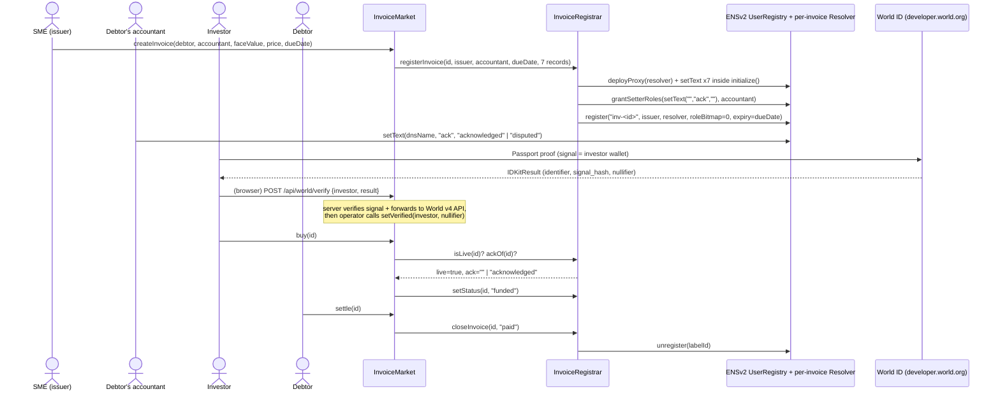

# Seikyu (請求)

Seikyu lets Japanese SMEs sell unpaid invoices to World ID–verified investors, with every invoice living as an ENSv2 name that expires on its due date.

Built for ETHGlobal Tokyo 2026, targeting **ENS Best Use of ENSv2**, **World Best Use of IDKit**, and **Curvegrid Best RWA Tokenization**.

1. **One-sentence summary**: Seikyu lets Japanese SMEs sell unpaid invoices to World ID–verified investors, with every invoice living as an ENSv2 name that expires on its due date.

2. **How we used MultiBaas**: Not used — evaluated for the activity feed, cut at the time-box; contracts are indexed by direct RPC reads.

3. **Team**

   | Name | Role | X / GitHub |
   |---|---|---|
   | TBD | TBD | TBD |

   <!-- FILL-H6: team names + X/GitHub handles -->

4. **Setup & testing** — see the full [Setup & testing](#setup--testing) section below.

5. **Experience with MultiBaas**: N/A (not used).

---

## What it does

1. An SME (issuer) calls `createInvoice()` in one transaction: an ERC-721 receivable is minted to escrow and `inv-<id>.<parent>.eth` is registered on our own ENSv2 `UserRegistry` with `expiry = dueDate` (`contracts/src/InvoiceMarket.sol:95-140`, `contracts/src/InvoiceRegistrar.sol:68-92`).
2. The debtor's accounts-payable team (the **accountant**, 取引先経理) acknowledges or disputes the invoice by writing the `ack` text record — the one and only record their wallet can write (`contracts/src/InvoiceRegistrar.sol:83-85`).
3. An investor who has passed World ID Passport verification buys the receivable at a discount; the sale only succeeds while the ENS name is live and `ack` is not `disputed` (`contracts/src/InvoiceMarket.sol:172-189`).
4. The SME receives the discounted price immediately on `buy()`; the investor now holds the ERC-721 and bears the debtor's default risk (non-recourse).
5. When the debtor pays in full via `settle()`, the investor receives face value, the token burns, and the ENS name is unregistered on the spot (`contracts/src/InvoiceMarket.sol:191-202`, `contracts/src/InvoiceRegistrar.sol:99-104`).
6. If the due date passes unpaid, the name expires on its own. A funded-but-unpaid invoice shows as **Overdue**; anyone can call `markOverdue()` to revive the expired name for 30 more days with `status = "overdue"` so it's still visible on public ENS clients (`contracts/src/InvoiceMarket.sol:223-233`, stretch feature). An unsold invoice past its due date shows as **Expired-unsold**.

## Architecture



## Why ENSv2 is load-bearing

1. Every invoice is a hierarchical registry entry under our own `UserRegistry`, itself the subregistry of `<parent>.eth` — not a flat record squatting on someone else's namespace (`contracts/script/DeployUserRegistry.s.sol:17-49`, `contracts/script/RegisterParent.s.sol:53-85`).
2. `expiry` is set to the invoice's `dueDate` at registration (`contracts/src/InvoiceRegistrar.sol:89`), so the name's lifetime tracks the debt's lifetime — it isn't a renewal cycle we control after the fact.
3. `InvoiceMarket.buy()` reads `REGISTRAR.isLive(id)` and `REGISTRAR.ackOf(id)` before every sale (`contracts/src/InvoiceMarket.sol:177,179-181`) — ENS state is a purchase gate the contract enforces, not a display layer the frontend merely reads.
4. The deployed `PermissionedResolver` scopes setter roles by record key only (`keccak256(key)`), never by name, so a resolver deployed per invoice (`contracts/src/InvoiceRegistrar.sol:162-178`) is the only way to confine the accountant's `ack`-only grant to a single invoice instead of every invoice from that issuer.
5. Records stay readable through the stored resolver after the name's ENS registration expires (path R), while liveness (path L) correctly flips to `false` — proven on a Sepolia fork by `test_statusOf_afterExpiry` and `test_settle_afterExpiry_writesPaidViaStoredResolver` (`contracts/test/InvoiceRegistrar.t.sol:139`, `contracts/test/Integration.t.sol:108`).

Full feature-by-feature mapping: [`docs/ENS_INTEGRATION.md`](docs/ENS_INTEGRATION.md).

## Why World ID Passport

Passport is the least-friction World ID credential that still gives **deterministic** uniqueness: Device gives none, Selfie Check's uniqueness is only a probabilistic "Sybil score", and Orb (Proof of Human) demands an in-person biometric scan we don't need just to bound a testnet pilot's exposure. Passport's document-level uniqueness lets `MAX_OPEN_POSITIONS = 3` (`contracts/src/InvoiceMarket.sol:44,216-224`) actually bound how many open receivables one person can hold — the accepted residual risk is that someone with two passports gets a 2× cap. Full credential comparison and verification pipeline: [`docs/WORLD_ID_DEBRIEF.md`](docs/WORLD_ID_DEBRIEF.md).

## Contract addresses (Sepolia)

Pre-existing ENSv2 contracts, pinned to tag `sepolia-deployment-2026-09-15` (commit `f2f0a05e`):

| Contract | Address | Notes |
|---|---|---|
| ETHRegistry | `0x657ea849311d3d5823348dded7c2aaafb3ede09e` | |
| ETHRegistrar | `0xabe76f6c8dfced81aa5a2bb8034202a7136b94ca` | `.eth` registrar, used once to register our parent |
| UserRegistryImpl | `0xa80338aaa8d23831cea25e858d1774534abb0263` | proxy implementation |
| PermissionedResolverImpl | `0x14f09fd05d4585759e54844dc9b00147131cf243` | proxy implementation, one proxy deployed per invoice |
| VerifiableFactory | `0x9e726eb570beb6bceb495ab8cda7df517d4e841c` | deploys our `UserRegistry` and every per-invoice resolver |
| UniversalResolverV2 | `0x5d25c1d6acbb71b7a28aa7899618a3412a8303e3` | not used for record reads (see disclosures) |
| ENS MockUSDC (`ensMockUsdc`) | `0x16f95d91dba7da3aca778ec053df0ff6c6a8aa8e` | ENS's own testnet token — pays **only** for the one-time parent registration |

Seikyu's own contracts (from `contracts/deployments/sepolia.json` at doc time):

| Contract | Address | Deployed by |
|---|---|---|
| Our `UserRegistry` | _pending deploy_ <!-- FILL-ADDR: userRegistry --> | `script/DeployUserRegistry.s.sol` |
| Parent name | _pending deploy_ <!-- FILL-ADDR: parentName --> | `script/RegisterParent.s.sol` |
| `InvoiceRegistrar` | _pending deploy_ <!-- FILL-ADDR: invoiceRegistrar --> | `script/Deploy.s.sol` |
| `InvoiceMarket` | _pending deploy_ <!-- FILL-ADDR: invoiceMarket --> | `script/Deploy.s.sol` |
| Our MockUSDC (`mUSDC`) | _pending deploy_ <!-- FILL-ADDR: mockUsdc --> | `script/Deploy.s.sol` |

There are **two mock USDCs**: ENS's `ensMockUsdc` above (parent registration only) and our own `mUSDC` (every price and settlement in `InvoiceMarket`).

## Live demo + video

- Live demo: <!-- FILL-H5: demo URL -->
- Video (≤ 3:00): <!-- FILL-VIDEO -->
- Demo script: [`docs/DEMO_SCRIPT.md`](docs/DEMO_SCRIPT.md)

## Gas & tests

- `forge test --fork-url $SEPOLIA_RPC_URL --fork-block-number 11781431` runs **46 tests, 0 failed**: 2 go/no-go (`contracts/test/fork/GoNoGo.t.sol`) + 14 `InvoiceRegistrar` (`contracts/test/InvoiceRegistrar.t.sol`) + 22 `InvoiceMarket` (`contracts/test/InvoiceMarket.t.sol`) + 4 integration (`contracts/test/Integration.t.sol`) + 4 overdue-revival (`contracts/test/Overdue.t.sol`, stretch feature A6).
- `bash contracts/script/selector-parity.sh` checks 26 selectors against the deployed bytecode of the pinned tag and prints `PARITY OK (26 selectors)`.
- Gas, measured on the Sepolia fork:
  - ENS operations only inside `registerInvoice` (per the go/no-go stub, `.omc/research/spike-ensv2.md`): 694,332 — `deployProxy`+`initialize` 154,853 / 7× `setText` 383,240 / `grantSetterRoles(ack)` 55,708 / `register` 100,531.
  - Full `InvoiceRegistrar.registerInvoice` call: 754,746.
  - Full `InvoiceMarket.createInvoice` call (mint + ENS registration + market bookkeeping): 952,840.
  - Sepolia gas price at the time these were measured: ≈ 1 gwei, so roughly 0.0008–0.001 ETH per invoice issued.

## Security & disclosures

- Invoice `amount` and `debtor` are public ENS text records — anyone who knows the invoice name can read them.
- The market is **non-recourse**: investors bear the debtor's default risk. There is no legal-recourse mechanism in this pilot.
- The issuer supplies both the debtor and accountant addresses at issuance, so `ack` is only as trustworthy as those addresses — it is **self-attested**. The contract only rejects the most obvious abuse: `accountant != issuer && debtor != issuer` (`contracts/src/InvoiceMarket.sol:100-105`, reverts `InvalidTerms`).
- Nothing on-chain stops the same invoice being sold again off-platform (double-factoring); `ack` from the debtor's accountant is the only on-chain signal against it.
- The operator key can only call `setVerified` (`contracts/src/InvoiceMarket.sol:142-152`). The owner can rotate it (`setOperator`), pause the market (`pause`/`unpause`), or clear a squatted nullifier (`revokeVerification`).
- `Harden.s.sol` revokes every root role the deployer holds on our `UserRegistry` — irreversible, meant to be run at feature freeze (`contracts/script/Harden.s.sol`). The parent name's owner on ENS's `ETHRegistry`, however, can still call `setSubregistry` on the parent; this is disclosed, not mitigated.
- MultiBaas was evaluated for the invoice activity feed and not used — time-boxed out (see item 2 above); the frontend reads state via direct RPC calls (`web/lib/invoices.ts`, `web/lib/ens.ts`).

## Prizes targeted

- **ENS — Best Use of ENSv2 ($6k)**: own hierarchical `UserRegistry` under `<parent>.eth`, expiring + revocable + non-transferable per-invoice subnames, a dedicated Permissioned Resolver + Enhanced Access Control per invoice, and ENS liveness/`ack` state read directly inside the on-chain purchase gate. Full mapping: [`docs/ENS_INTEGRATION.md`](docs/ENS_INTEGRATION.md).
- **World — Best Use of IDKit ($2.5k)**: least-friction credential with deterministic uniqueness, a full 8-step server-side verification pipeline, on-chain nullifier binding with a documented squatting mitigation, and 5 documented failure paths. Full debrief: [`docs/WORLD_ID_DEBRIEF.md`](docs/WORLD_ID_DEBRIEF.md).
- **Curvegrid — Best RWA Tokenization ($1k)**: an ERC-721 receivable with programmable transfer controls (`_update` verified-investor allowlist + per-person position cap) and a debtor-acknowledgment gate before sale. MultiBaas itself was evaluated and cut under the time-box (see items 2 and 5 above).

## Setup & testing

### Prerequisites

- [Foundry](https://getfoundry.sh/) (`forge`, `cast`, `anvil`): `curl -L https://foundry.paradigm.xyz | bash && foundryup`
- Node.js ≥ 20 (built and tested on v24)
- pnpm ≥ 9

### Clone

```bash
git clone --recursive <repo-url>
# or, if already cloned without --recursive:
git submodule update --init --recursive
```

Submodules (`contracts/lib/`): `forge-std`, `openzeppelin-contracts` (v5.1.0), `contracts-v2` (pinned to `ensdomains/contracts-v2@sepolia-deployment-2026-09-15`, commit `f2f0a05e`).

### Environment

Copy both example files and fill them in:

```bash
cp contracts/.env.example contracts/.env
cp web/.env.example web/.env.local
```

`contracts/.env.example` (Foundry scripts): `SEPOLIA_RPC_URL`, `SEPOLIA_RPC_URL_BACKUP`, `FORK_BLOCK`, `ETHERSCAN_API_KEY`, `DEPLOYER_PRIVATE_KEY`, `DEPLOYER_ADDRESS`, `OPERATOR_ADDRESS`, `PARENT_LABEL`, `PARENT_SECRET`, `SME_ADDRESS`, `INVESTOR_A`, `INVESTOR_A2`, `DEBTOR_ADDRESS`, `DEBTOR_AP_ADDRESS`.

`web/.env.example` (Next.js): public — `NEXT_PUBLIC_SEPOLIA_RPC_URL`, `NEXT_PUBLIC_WC_PROJECT_ID`, `NEXT_PUBLIC_WORLD_APP_ID`, `NEXT_PUBLIC_WORLD_ACTION` (`buy-receivable`), `NEXT_PUBLIC_WORLD_PRESET` (`passport`); server-only — `SEPOLIA_RPC_URL`, `WORLD_RP_ID`, `WORLD_RP_SIGNING_KEY`, `WORLD_ENV` (`staging`), `OPERATOR_PRIVATE_KEY`, `LOCAL_MARKET_ADDRESS` (dev-only, rejected in production by `web/lib/env.ts:95-99`).

### Build and test the contracts

```bash
cd contracts
forge build                                                              # AC-1
forge test --fork-url $SEPOLIA_RPC_URL --fork-block-number $FORK_BLOCK    # AC-2: 46 tests passed, 0 failed
bash script/selector-parity.sh                                           # AC-21: PARITY OK (26 selectors)
```

### Deploy to Sepolia (in this order)

```bash
cd contracts
# E2 — deploy our UserRegistry proxy through the ENSv2 VerifiableFactory
forge script script/DeployUserRegistry.s.sol --rpc-url $SEPOLIA_RPC_URL --broadcast

# E1 — commit, then register the parent name once >= MIN_COMMITMENT_AGE (60s) has passed
forge script script/RegisterParent.s.sol --sig "commit()"   --rpc-url $SEPOLIA_RPC_URL --broadcast
# wait >= 60s
forge script script/RegisterParent.s.sol --sig "register()" --rpc-url $SEPOLIA_RPC_URL --broadcast
forge script script/RegisterParent.s.sol --sig "verify()"    --rpc-url $SEPOLIA_RPC_URL   # read-only sanity check

# E3/E4 — deploy MockUSDC, InvoiceRegistrar, InvoiceMarket; grant the registrar its roles; wire the market in
forge script script/Deploy.s.sol --rpc-url $SEPOLIA_RPC_URL --broadcast --verify --etherscan-api-key $ETHERSCAN_API_KEY

# Fund the demo wallets (ETH + mUSDC)
forge script script/Seed.s.sol --rpc-url $SEPOLIA_RPC_URL --broadcast

# Later, at feature freeze — irreversible: revoke every root role the deployer holds on UserRegistry
forge script script/Harden.s.sol --rpc-url $SEPOLIA_RPC_URL --broadcast
```

Each script reads and writes `contracts/deployments/sepolia.json` directly (via `vm.readFile`/`vm.writeJson`), so it can be re-run safely — every script checks what's already been written before broadcasting.

### Web app

```bash
cd web
pnpm install
node scripts/sync-deployments.mjs   # copy contracts/deployments/sepolia.json -> lib/deployments.sepolia.json
pnpm wagmi:generate                  # generate lib/generated.ts from contracts/out/*.json (requires `forge build` first)
pnpm dev                             # http://localhost:3000
# or: pnpm build && pnpm start
```

### Diagnostic & end-to-end scripts (`web/scripts/`)

```bash
# Path R + path L for one invoice name: prints all 8 text records, RESOLVES and LIVE_STATE
pnpm exec tsx scripts/check-ens.ts inv-1.<parent>

# EAC negative path: accountant's ack write succeeds, amount/status writes revert EACUnauthorizedAccountRoles
pnpm exec tsx scripts/eac-negative.ts inv-1.<parent>

# End-to-end driver against a live InvoiceMarket (Sepolia or an anvil rehearsal)
pnpm exec tsx scripts/e2e-sepolia.ts --seed             # seeds demo invoices, prints an EXPIRY_DEMO name
pnpm exec tsx scripts/e2e-sepolia.ts --flow             # create -> verify -> buy -> settle, prints each tx hash
pnpm exec tsx scripts/e2e-sepolia.ts --status <name>    # prints current on-chain state for one invoice
```

### World ID Developer Portal setup

1. Create a **staging** app at [developer.world.org](https://developer.world.org) (aka developer.worldcoin.org).
2. Register the action **`buy-receivable`** on that app — it must match `NEXT_PUBLIC_WORLD_ACTION`.
3. Copy the three values the portal gives you into `web/.env.local`:
   - `NEXT_PUBLIC_WORLD_APP_ID=app_staging_...` (public, must start with `app_`)
   - `WORLD_RP_ID=...` (server-only)
   - `WORLD_RP_SIGNING_KEY=...` (server-only — never expose client-side)
4. Leave `NEXT_PUBLIC_WORLD_PRESET=passport` and `WORLD_ENV=staging` for local development.
5. Test against the simulator at [simulator.worldcoin.org](https://simulator.worldcoin.org/) before trying a real World App scan.

Full verification architecture and fail paths: [`docs/WORLD_ID_DEBRIEF.md`](docs/WORLD_ID_DEBRIEF.md).

## License

MIT — see [LICENSE](LICENSE).
