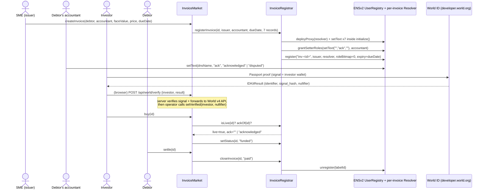

# Seikyu (請求)

Seikyu lets Japanese SMEs sell unpaid invoices to World ID–verified investors, with every invoice living as an ENSv2 name that expires on its due date.

Built for ETHGlobal Tokyo 2026, targeting **ENS Best Use of ENSv2**, **World Best Use of IDKit**, and **Curvegrid Best RWA Tokenization**.

1. **One-sentence summary**: Seikyu lets Japanese SMEs sell unpaid invoices to World ID–verified investors, with every invoice living as an ENSv2 name that expires on its due date.

2. **How we used MultiBaas**: Not used — evaluated for the activity feed, cut at the time-box; contracts are indexed by direct RPC reads.

3. **Team**

   | Name | Role | X / GitHub |
   |---|---|---|
   | Ikhalas Mannoon | Lead / integrator (ran every session, holds deployer + operator keys) | [@ikhalas112](https://github.com/ikhalas112) |
   | Patipol Pantarat | Team member (web developer) | [@KoonPorZa](https://github.com/KoonPorZa) |
   | Prakasit "Farm" Lertprakitsin | Team member (web developer) | [@prakasit-lertprakitsin](https://github.com/prakasit-lertprakitsin) |
   | Anothai Vichapaiboon | Team member (CS student, agentic systems) | [@TaiChi112](https://github.com/TaiChi112) |

   How the work was split between people and AI is stated in [`docs/AI_USAGE.md`](docs/AI_USAGE.md).

4. **Setup & testing** — see the full [Setup & testing](#setup--testing) section below.

5. **Experience with MultiBaas**: N/A (not used).

---

## What it does

1. An SME (issuer) calls `createInvoice()` in one transaction: an ERC-721 receivable is minted to escrow and `inv-<id>.<parent>.eth` is registered on our own ENSv2 `UserRegistry` with `expiry = dueDate` (`contracts/src/InvoiceMarket.sol:95-140`, `contracts/src/InvoiceRegistrar.sol:68-92`).
2. The debtor's accounts-payable team (the **accountant**, 取引先経理) acknowledges or disputes the invoice by writing the `ack` text record — the one and only record their wallet can write (`contracts/src/InvoiceRegistrar.sol:83-85`).
3. An investor who has passed World ID Passport verification buys the receivable at a discount; the sale only succeeds while the ENS name is live and `ack` is not `disputed` (`contracts/src/InvoiceMarket.sol:172-189`).
4. The SME receives the discounted price immediately on `buy()`; the investor now holds the ERC-721 and bears the debtor's default risk (non-recourse).
5. When the debtor pays in full via `settle()`, the investor receives face value, the token burns, and the ENS name is unregistered on the spot (`contracts/src/InvoiceMarket.sol:191-202`, `contracts/src/InvoiceRegistrar.sol:99-104`).
6. If the due date passes unpaid, the name expires on its own. A funded-but-unpaid invoice shows as **Overdue**; anyone can call `markOverdue()` to revive the expired name for 30 more days with `status = "overdue"` so it's still visible on public ENS clients (`contracts/src/InvoiceMarket.sol:223-233`, stretch feature). An unsold invoice past its due date shows as **Expired-unsold**.

## Architecture



## Why ENSv2 is load-bearing

1. Every invoice is a hierarchical registry entry under our own `UserRegistry`, itself the subregistry of `<parent>.eth` — not a flat record squatting on someone else's namespace (`contracts/script/DeployUserRegistry.s.sol:17-49`, `contracts/script/RegisterParent.s.sol:53-85`).
2. `expiry` is set to the invoice's `dueDate` at registration (`contracts/src/InvoiceRegistrar.sol:89`), so the name's lifetime tracks the debt's lifetime — it isn't a renewal cycle we control after the fact.
3. `InvoiceMarket.buy()` reads `REGISTRAR.isLive(id)` and `REGISTRAR.ackOf(id)` before every sale (`contracts/src/InvoiceMarket.sol:177,179-181`) — ENS state is a purchase gate the contract enforces, not a display layer the frontend merely reads.
4. The deployed `PermissionedResolver` scopes setter roles by record key only (`keccak256(key)`), never by name, so a resolver deployed per invoice (`contracts/src/InvoiceRegistrar.sol:162-178`) is the only way to confine the accountant's `ack`-only grant to a single invoice instead of every invoice from that issuer.
5. Records stay readable through the stored resolver after the name's ENS registration expires (path R), while liveness (path L) correctly flips to `false` — proven on a Sepolia fork by `test_statusOf_afterExpiry` and `test_settle_afterExpiry_writesPaidViaStoredResolver` (`contracts/test/InvoiceRegistrar.t.sol:139`, `contracts/test/Integration.t.sol:108`).

Full feature-by-feature mapping: [`docs/ENS_INTEGRATION.md`](docs/ENS_INTEGRATION.md).

## Why World ID Passport

Passport is the least-friction World ID credential that still gives **deterministic** uniqueness: Device gives none, Selfie Check's uniqueness is only a probabilistic "Sybil score", and Orb (Proof of Human) demands an in-person biometric scan we don't need just to bound a testnet pilot's exposure. Passport's document-level uniqueness lets `MAX_OPEN_POSITIONS = 3` (`contracts/src/InvoiceMarket.sol:44,216-224`) actually bound how many open receivables one person can hold — the accepted residual risk is that someone with two passports gets a 2× cap. Passport verification was proven live end-to-end on this deployment ([`InvestorVerified` tx](https://eth-sepolia.blockscout.com/tx/0xffdf3910f2e55373ac6a084bab8575a593c0467050bb3a026f3b1cc11ef3b975)).

**Why the recorded demo uses Proof of Human, plus a Simulator toggle, instead**: World's staging Simulator's default "World ID 4.0" mode is backed by one shared staging signer — every one of its five test identities produces the *same* nullifier under **either** Passport or Proof of Human, so on staging only one wallet, ever, can complete v4 verification per action. That's a tooling artifact, not a credential limitation. The demo therefore runs with `NEXT_PUBLIC_WORLD_PRESET=proofOfHuman` **and** the Simulator's own "Legacy v3 proof" toggle enabled, which is the only combination that gives each test identity its own distinct nullifier. Using Proof of Human at all here is honestly **over-assured because of tooling** — production intent remains Passport (document-level uniqueness, lower friction than Orb). Full story: [`docs/WORLD_ID_DEBRIEF.md`](docs/WORLD_ID_DEBRIEF.md).

## Contract addresses (Sepolia)

Pre-existing ENSv2 contracts, pinned to tag `sepolia-deployment-2026-09-15` (commit `f2f0a05e`):

| Contract | Address | Notes |
|---|---|---|
| ETHRegistry | `0x657ea849311d3d5823348dded7c2aaafb3ede09e` | |
| ETHRegistrar | `0xabe76f6c8dfced81aa5a2bb8034202a7136b94ca` | `.eth` registrar, used once to register our parent |
| UserRegistryImpl | `0xa80338aaa8d23831cea25e858d1774534abb0263` | proxy implementation |
| PermissionedResolverImpl | `0x14f09fd05d4585759e54844dc9b00147131cf243` | proxy implementation, one proxy deployed per invoice |
| VerifiableFactory | `0x9e726eb570beb6bceb495ab8cda7df517d4e841c` | deploys our `UserRegistry` and every per-invoice resolver |
| UniversalResolverV2 | `0x5d25c1d6acbb71b7a28aa7899618a3412a8303e3` | not used for record reads (see disclosures) |
| ENS MockUSDC (`ensMockUsdc`) | `0x16f95d91dba7da3aca778ec053df0ff6c6a8aa8e` | ENS's own testnet token — pays **only** for the one-time parent registration |

Seikyu's own contracts, live on Sepolia (from `contracts/deployments/sepolia.json`):

| Contract | Address | Deployed by |
|---|---|---|
| Our `UserRegistry` | `0xA9DFC9d1D5EA96b5Ade09d0E9B84944965B4eD67` | `script/DeployUserRegistry.s.sol` ([tx](https://eth-sepolia.blockscout.com/tx/0xd2bba84501953caf250623987fbdbf8cea6129dce0d80e92f70c2dd757ac213c)) |
| Parent name | `seikyu.eth` | `script/RegisterParent.s.sol` (commit [tx](https://eth-sepolia.blockscout.com/tx/0x9e31c31403cca6412055a4847b244987a59e0d05a702964afc035b4951b73c2f), register [tx](https://eth-sepolia.blockscout.com/tx/0x7b31788bd5f7bef84a84530cdec3c289d7b1e13ad051319f500eda5ea067b913), block 11784477, fee 8,000,021 ENS-mUSDC) |
| `InvoiceRegistrar` | [`0x628701e9A322B019e4aFe31A077f393644D748eF`](https://eth-sepolia.blockscout.com/address/0x628701e9A322B019e4aFe31A077f393644D748eF) | `script/Deploy.s.sol` |
| `InvoiceMarket` | [`0x9Cf9989AfC0196720aa0A64F61a614CFB548B875`](https://eth-sepolia.blockscout.com/address/0x9Cf9989AfC0196720aa0A64F61a614CFB548B875) | `script/Deploy.s.sol` |
| Our MockUSDC (`mUSDC`) | [`0x6B41ADF3e9A858136C28dfAC2432Eb2356E5451D`](https://eth-sepolia.blockscout.com/address/0x6B41ADF3e9A858136C28dfAC2432Eb2356E5451D) | `script/Deploy.s.sol` |

Deploy block `11784486` (contract-creation txs in blocks 11784489–11784494; raw receipts committed under `contracts/broadcast/*/11155111/`). **Source verification**: all three are [Sourcify](https://sourcify.dev) exact-match (solc `0.8.27`, 200 runs, `cancun`) — [MockUSDC](https://sourcify.dev/#/lookup/0x6B41ADF3e9A858136C28dfAC2432Eb2356E5451D), [InvoiceRegistrar](https://sourcify.dev/#/lookup/0x628701e9A322B019e4aFe31A077f393644D748eF), [InvoiceMarket](https://sourcify.dev/#/lookup/0x9Cf9989AfC0196720aa0A64F61a614CFB548B875) — and [Blockscout](https://eth-sepolia.blockscout.com) has imported all three with full source (linked above; use it as the primary explorer). Etherscan shows an exact match only for `InvoiceRegistrar`; the other two show as "similar match" pending an Etherscan API key.

Demo wallets: operator `0x61461a6a0E817a915566CeD94e661eE9Eefbe359`, SME (issuer) `0x0df1770bB1b839E9aF883FcBD2C90ae27181385f`, investor A `0x601344DFBEd3Cc685CF49190f39c18B1b570C131`, investor A2 `0xC91913F3eCDef9D30816C5D2d424142f3ABfD9c8`, debtor `0xb6359D76E104a9fF007c979d5b18b2804578E72B`, debtor's accountant `0xe1D7a414963005BdCeecA0da42a50A3FFF7d9aDe`.

There are **two mock USDCs**: ENS's `ensMockUsdc` above (parent registration only) and our own `mUSDC` (every price and settlement in `InvoiceMarket`).

## Live demo + video

- Live demo: https://seikyu.xyz (Vercel, Sepolia)
- Video (≤ 3:00): <!-- FILL-VIDEO -->
- Demo script: [`docs/DEMO_SCRIPT.md`](docs/DEMO_SCRIPT.md)
- User guide (Thai): [`docs/USER_GUIDE.md`](docs/USER_GUIDE.md) — 33 screenshots captured from the live Sepolia deployment (issue, verify, buy, accountant ack/dispute, settle, cancel)
- Live on-chain flow so far (full feature-by-feature tx table: [`docs/ENS_INTEGRATION.md`](docs/ENS_INTEGRATION.md)):
  - [`createInvoice` → inv-1.seikyu.eth](https://eth-sepolia.blockscout.com/tx/0x0a0d4954e2115ebe18cf86461d50f3d136d2979dd5f4892aa21bbfc2f16b184b) (due in 7 days)
  - [`createInvoice` → inv-2.seikyu.eth](https://eth-sepolia.blockscout.com/tx/0x4e089388900ad4349a5905b45fcf5669ab1fc2ef8eb972a09c25b81752dbb21f) (the +10-minute expiry demo name)
  - [accountant `setText(ack="acknowledged")` on inv-1](https://eth-sepolia.blockscout.com/tx/0xc118b4106a306f511e3f49ccba78be1647b36cf31485630cb34aea217c6adedb) — `amount`/`status` edits from the same wallet were rejected as simulated reverts (`EACUnauthorizedAccountRoles`, never broadcast — see `web/scripts/eac-negative.ts` output)
  - `check-ens.ts inv-1.seikyu.eth`: all 8 records readable via the stored resolver, `RESOLVES: true`, `LIVE_STATE: REGISTERED`
  - `check-ens.ts` on inv-2 after its due date passed: `RESOLVES: false`, `LIVE_STATE: AVAILABLE`, `records[status]=listed` — records still readable, liveness correctly gone (see [`docs/ENS_INTEGRATION.md`](docs/ENS_INTEGRATION.md) "Records survive expiry")
  - A real World ID Passport proof from the simulator, verified server-side and recorded on-chain: [`InvestorVerified` tx](https://eth-sepolia.blockscout.com/tx/0xffdf3910f2e55373ac6a084bab8575a593c0467050bb3a026f3b1cc11ef3b975) (block 11785076, wallet `0x2aaA…259A`) — this proved the `passport` code path works, but the Simulator's default v4 mode shares one signer across every identity and credential, so only one wallet can ever do this on staging (see [`docs/WORLD_ID_DEBRIEF.md`](docs/WORLD_ID_DEBRIEF.md))
  - Investor A `0x601344DFBEd3Cc685CF49190f39c18B1b570C131` verified live with `proofOfHuman` + the Simulator's "Legacy v3 proof" mode (the combination that actually gives distinct nullifiers): [`InvestorVerified` tx](https://eth-sepolia.blockscout.com/tx/0xde353f1a30fdf850010d72aadb34a5c194bee5128ad1e39e17803e392400a38c) (block 11785389), nullifier `0x274a1ab1106a0b40586c316c6d2a17a7700c99bd367b770f18e01d506a06c29b`
  - F3 confirmed on-chain: `setVerified(investorA2, <Investor A's nullifier>)` reverts `NullifierAlreadyUsed(0x6013…C131)` (selector `0x183d4b06`) at `estimateGas` — simulated revert via `cast send`, no tx exists; **F3 was also reproduced live in the UI**, investor A2 got `409 NULLIFIER_ALREADY_USED` bound to investor A
  - Full happy path on `inv-3.seikyu.eth`, captured for the user guide: [`createInvoice` via `/issue`](https://eth-sepolia.blockscout.com/tx/0xb5195264ea0f584d8719cf3f6dd9739d626966f51286aaeba8274cc460e5aac7) → [accountant `ack="acknowledged"`](https://eth-sepolia.blockscout.com/tx/0x7e68a92bde64eb7a50d09c4c447492be289de476d952bf0a3b6e80cad6bce791) → [`approve`](https://eth-sepolia.blockscout.com/tx/0x347cb0a08a6b80c4658f824540e0d8bbf7d982a5aa813cc33b54d09d2c85bdc2) + [`buy()`](https://eth-sepolia.blockscout.com/tx/0x0d7925a9cf6312b838db157d5f8d8751ad131f0cf5301befae6ac4022eef382a) → [`approve`](https://eth-sepolia.blockscout.com/tx/0x63768f285573c5ebdc72b8d7488d071f55168ae651a08a7514d66bc2ec19de10) + [`settle()`](https://eth-sepolia.blockscout.com/tx/0x5137876ee18d97cd1967685922c1f9842e0ce7319d92f36b583d9d50212de9cb) — token burned, name unregistered
  - Dispute-blocks-sale path on `inv-4.seikyu.eth`: [`createInvoice`](https://eth-sepolia.blockscout.com/tx/0x9f6997c1bd22c8d07d8803b4eb95145495cf6471a747ed2eb1492dc0c4d4c0c8) → accountant sets [`ack="disputed"`](https://eth-sepolia.blockscout.com/tx/0x2f470b242bf22a6b151a670f3d20b932135198ed8b8d480a7f98bebfbd869068) → `buy()` reverts `PurchaseBlockedByAck` (simulated revert, no tx) → issuer [`cancel()`](https://eth-sepolia.blockscout.com/tx/0xb1c8d9fd0c6d9e7115f920ccc70d86f3315f92d52c211175822d4d13b8d2a1b1) unregisters the unsold name
  - **AC-16 scripted end-to-end flow passed** on `inv-5.seikyu.eth` via `web/scripts/e2e-sepolia.ts --flow`: CREATE [`0x521e486b…dc8cc`](https://eth-sepolia.blockscout.com/tx/0x521e486b00f0a91012c29b574448cda742e7953c22b6b5203d49a85407cdc8cc) → VERIFY (reused) → approve → BUY [`0x493be34b…bcb17`](https://eth-sepolia.blockscout.com/tx/0x493be34bea973a25bb78808883fe0f025c975b9c41a4ade62b864f667f0bcb17) → approve → SETTLE [`0x00abfd3b…20dd`](https://eth-sepolia.blockscout.com/tx/0x00abfd3b59862462f18ba367ed8e8f9d1533e44c3d5b71ac1b504eed4ef220dd) — printed `STATE=3 LIVE_STATE=AVAILABLE records[status]=paid`; full tx list in [`docs/ENS_INTEGRATION.md`](docs/ENS_INTEGRATION.md#how-to-verify-on-chain)
  - **Hardened live**: [`Harden.run()`](https://eth-sepolia.blockscout.com/tx/0xde2f1130b97117aaf09a0039c241ad1d4ae5b08d8a78186ea88b732fd17dbe51) (block 11785532) revoked the deployer's admin-only bits on `UserRegistry` down to `0` (AC-20 verified: `roles(0, deployer)` reads `0`); `InvoiceRegistrar` keeps `REGISTRAR_ROOT`. Issuing still works post-harden: [`createInvoice`](https://eth-sepolia.blockscout.com/tx/0xcda7c60db3db2bc828f52fc1db427a90bd5a25367835518117a691aa768f11c0) (block 11785534, 918,628 gas) → `inv-6.seikyu.eth`, `isLive` `true`
  - **Overdue revival confirmed live** on `inv-7.seikyu.eth`: [`createInvoice`](https://eth-sepolia.blockscout.com/tx/0x7c371cac0af1643b0299f0d1b951823190bae3e455a38c141691eb6d2062e7fb) (150s tenor) → [`buy()`](https://eth-sepolia.blockscout.com/tx/0xa81b28d344727780fccf03725abd11837a81669dc801f8a53782c6f323a79e8d) → left to expire → [`markOverdue(7)`](https://eth-sepolia.blockscout.com/tx/0x87e44abb349f6825cee73ce6e43d2d2a0aad017b90ab64a9c20f2b8b20e410b8) revives the name (`REGISTERED`, same SME owner, new expiry `1793010720`) with `status="overdue"` while the market stays `Funded`; left in that state on purpose for the demo — see [`docs/ENS_INTEGRATION.md`](docs/ENS_INTEGRATION.md) for the full trace

## Gas & tests

- `forge test --fork-url https://sepolia.gateway.tenderly.co --fork-block-number 11784478` runs **46 tests, 0 failed**: 2 go/no-go (`contracts/test/fork/GoNoGo.t.sol`) + 14 `InvoiceRegistrar` (`contracts/test/InvoiceRegistrar.t.sol`) + 22 `InvoiceMarket` (`contracts/test/InvoiceMarket.t.sol`) + 4 integration (`contracts/test/Integration.t.sol`) + 4 overdue-revival (`contracts/test/Overdue.t.sol`, stretch feature A6). (Public RPCs have pruned this block; an archive RPC is required — see [Setup & testing](#build-and-test-the-contracts).)
- `bash contracts/script/selector-parity.sh` checks 26 selectors against the deployed bytecode of the pinned tag and prints `PARITY OK (26 selectors)`.
- Gas, measured on the Sepolia fork:
  - ENS operations only inside `registerInvoice` (per the go/no-go stub, `.omc/research/spike-ensv2.md`): 694,332 — `deployProxy`+`initialize` 154,853 / 7× `setText` 383,240 / `grantSetterRoles(ack)` 55,708 / `register` 100,531.
  - Full `InvoiceRegistrar.registerInvoice` call: 754,746.
  - Full `InvoiceMarket.createInvoice` call (mint + ENS registration + market bookkeeping): 952,840.
  - Sepolia gas price at the time these were measured: ≈ 1 gwei, so roughly 0.0008–0.001 ETH per invoice issued.

## Security & disclosures

- Invoice `amount` and `debtor` are public ENS text records — anyone who knows the invoice name can read them.
- The market is **non-recourse**: investors bear the debtor's default risk. There is no legal-recourse mechanism in this pilot.
- The issuer supplies both the debtor and accountant addresses at issuance, so `ack` is only as trustworthy as those addresses — it is **self-attested**. The contract only rejects the most obvious abuse: `accountant != issuer && debtor != issuer` (`contracts/src/InvoiceMarket.sol:100-105`, reverts `InvalidTerms`).
- Nothing on-chain stops the same invoice being sold again off-platform (double-factoring); `ack` from the debtor's accountant is the only on-chain signal against it.
- The operator key can only call `setVerified` (`contracts/src/InvoiceMarket.sol:142-152`). The owner can rotate it (`setOperator`), pause the market (`pause`/`unpause`), or clear a squatted nullifier (`revokeVerification`).
- `Harden.s.sol` revokes every root role the deployer holds on our `UserRegistry` — irreversible, run at feature freeze (`contracts/script/Harden.s.sol`; **run live**: [tx](https://eth-sepolia.blockscout.com/tx/0xde2f1130b97117aaf09a0039c241ad1d4ae5b08d8a78186ea88b732fd17dbe51), the deployer's `roles(0, deployer)` is now `0`, confirmed by AC-20). The parent name's owner on ENS's `ETHRegistry`, however, can still call `setSubregistry` on the parent; this is disclosed, not mitigated.
- MultiBaas was evaluated for the invoice activity feed and not used — time-boxed out (see item 2 above); the frontend reads state via direct RPC calls (`web/lib/invoices.ts`, `web/lib/ens.ts`).

## AI usage & planning artifacts

This project was built spec-first with Claude Code: AI agents drafted and reviewed the plan, wrote every source file, and ran the tests and deployments; the humans chose the target, approved the plan, did every external-account and funding step, and reviewed the results. Every commit carries a `Co-Authored-By: Claude` trailer. The full statement of which parts used AI is [`docs/AI_USAGE.md`](docs/AI_USAGE.md); the plan, PRD, research spikes, progress log, and every prompt (human-typed and agent-directed, secrets redacted) are in [`docs/planning/`](docs/planning/README.md).

## Prizes targeted

- **ENS — Best Use of ENSv2 ($6k)**: own hierarchical `UserRegistry` under `<parent>.eth`, expiring + revocable + non-transferable per-invoice subnames, a dedicated Permissioned Resolver + Enhanced Access Control per invoice, and ENS liveness/`ack` state read directly inside the on-chain purchase gate. Full mapping: [`docs/ENS_INTEGRATION.md`](docs/ENS_INTEGRATION.md).
- **World — Best Use of IDKit ($2.5k)**: least-friction credential with deterministic uniqueness, a full 8-step server-side verification pipeline, on-chain nullifier binding with a documented squatting mitigation, and 5 documented failure paths. Full debrief: [`docs/WORLD_ID_DEBRIEF.md`](docs/WORLD_ID_DEBRIEF.md).
- **Curvegrid — Best RWA Tokenization ($1k)**: an ERC-721 receivable with programmable transfer controls (`_update` verified-investor allowlist + per-person position cap) and a debtor-acknowledgment gate before sale. MultiBaas itself was evaluated and cut under the time-box (see items 2 and 5 above).

## Setup & testing

### Prerequisites

- [Foundry](https://getfoundry.sh/) (`forge`, `cast`, `anvil`): `curl -L https://foundry.paradigm.xyz | bash && foundryup`
- Node.js ≥ 20 (built and tested on v24)
- pnpm ≥ 9

### Clone

```bash
git clone --recursive https://github.com/eth-2026-seikyu/seikyu.git
# or, if already cloned without --recursive:
git submodule update --init --recursive
```

Submodules (`contracts/lib/`): `forge-std`, `openzeppelin-contracts` (v5.1.0), `contracts-v2` (pinned to `ensdomains/contracts-v2@sepolia-deployment-2026-09-15`, commit `f2f0a05e`).

### Environment

Copy both example files and fill them in:

```bash
cp contracts/.env.example contracts/.env
cp web/.env.example web/.env.local
```

`contracts/.env.example` (Foundry scripts): `SEPOLIA_RPC_URL`, `SEPOLIA_RPC_URL_BACKUP`, `FORK_BLOCK`, `ETHERSCAN_API_KEY`, `DEPLOYER_PRIVATE_KEY`, `DEPLOYER_ADDRESS`, `OPERATOR_ADDRESS`, `PARENT_LABEL`, `PARENT_SECRET`, `SME_ADDRESS`, `INVESTOR_A`, `INVESTOR_A2`, `DEBTOR_ADDRESS`, `DEBTOR_AP_ADDRESS`.

`web/.env.example` (Next.js): public — `NEXT_PUBLIC_SEPOLIA_RPC_URL`, `NEXT_PUBLIC_WC_PROJECT_ID`, `NEXT_PUBLIC_WORLD_APP_ID`, `NEXT_PUBLIC_WORLD_ACTION` (`buy-receivable`), `NEXT_PUBLIC_WORLD_PRESET` (`passport`); server-only — `SEPOLIA_RPC_URL`, `WORLD_RP_ID`, `WORLD_RP_SIGNING_KEY`, `OPERATOR_PRIVATE_KEY`, `LOCAL_MARKET_ADDRESS` (dev-only, rejected in production by `web/lib/env.ts:95-99`). The World ID `environment` value ("staging"/"sandbox"/"production", default "staging") is read straight from `NEXT_PUBLIC_WORLD_ENVIRONMENT` by `worldEnvironment()` (`web/lib/world.ts:90-93`) and shared as-is by both the client widget prop and the server's verify check — not yet added to `web/.env.example` (falls back to "staging" if unset), superseding the older server-only `WORLD_ENV` name.

### Build and test the contracts

```bash
cd contracts
forge build                                                              # AC-1
forge test --fork-url $SEPOLIA_RPC_URL --fork-block-number $FORK_BLOCK    # AC-2: 46 tests passed, 0 failed
bash script/selector-parity.sh                                           # AC-21: PARITY OK (26 selectors)
```

`FORK_BLOCK` is `11784478` (post-registration — see `contracts/deployments/sepolia.json`). Public RPCs (publicnode, 1rpc) have already pruned that block, so fork tests need an archive RPC, e.g. `SEPOLIA_RPC_URL=https://sepolia.gateway.tenderly.co`.

### Deploy to Sepolia (in this order)

```bash
cd contracts
# E2 — deploy our UserRegistry proxy through the ENSv2 VerifiableFactory
forge script script/DeployUserRegistry.s.sol --rpc-url $SEPOLIA_RPC_URL --broadcast

# E1 — commit, then register the parent name once >= MIN_COMMITMENT_AGE (60s) has passed
forge script script/RegisterParent.s.sol --sig "commit()"   --rpc-url $SEPOLIA_RPC_URL --broadcast
# wait >= 60s
forge script script/RegisterParent.s.sol --sig "register()" --rpc-url $SEPOLIA_RPC_URL --broadcast
forge script script/RegisterParent.s.sol --sig "verify()"    --rpc-url $SEPOLIA_RPC_URL   # read-only sanity check

# E3/E4 — deploy MockUSDC, InvoiceRegistrar, InvoiceMarket; grant the registrar its roles; wire the market in
forge script script/Deploy.s.sol --rpc-url $SEPOLIA_RPC_URL --broadcast --verify --etherscan-api-key $ETHERSCAN_API_KEY

# Fund the demo wallets (ETH + mUSDC)
forge script script/Seed.s.sol --rpc-url $SEPOLIA_RPC_URL --broadcast

# Later, at feature freeze — irreversible: revoke every root role the deployer holds on UserRegistry
forge script script/Harden.s.sol --rpc-url $SEPOLIA_RPC_URL --broadcast
```

Each script reads and writes `contracts/deployments/sepolia.json` directly (via `vm.readFile`/`vm.writeJson`), so it can be re-run safely — every script checks what's already been written before broadcasting.

### Web app

```bash
cd web
pnpm install
node scripts/sync-deployments.mjs   # copy contracts/deployments/sepolia.json -> lib/deployments.sepolia.json
pnpm wagmi:generate                  # generate lib/generated.ts from contracts/out/*.json (requires `forge build` first)
pnpm dev                             # http://localhost:3000
# or: pnpm build && pnpm start
```

### Diagnostic & end-to-end scripts (`web/scripts/`)

```bash
# Path R + path L for one invoice name: prints all 8 text records, RESOLVES and LIVE_STATE
pnpm exec tsx scripts/check-ens.ts inv-1.<parent>

# EAC negative path: accountant's ack write succeeds, amount/status writes revert EACUnauthorizedAccountRoles
pnpm exec tsx scripts/eac-negative.ts inv-1.<parent>

# End-to-end driver against a live InvoiceMarket (Sepolia or an anvil rehearsal)
pnpm exec tsx scripts/e2e-sepolia.ts --seed             # seeds demo invoices, prints an EXPIRY_DEMO name
pnpm exec tsx scripts/e2e-sepolia.ts --flow             # create -> verify -> buy -> settle, prints each tx hash
pnpm exec tsx scripts/e2e-sepolia.ts --status <name>    # prints current on-chain state for one invoice
```

### World ID Developer Portal setup

1. Create a **staging** app at [developer.world.org](https://developer.world.org) (aka developer.worldcoin.org).
2. Register the action **`buy-receivable`** on that app — it must match `NEXT_PUBLIC_WORLD_ACTION`.
3. Copy the three values the portal gives you into `web/.env.local`:
   - `NEXT_PUBLIC_WORLD_APP_ID=app_staging_...` (public, must start with `app_`)
   - `WORLD_RP_ID=...` (server-only)
   - `WORLD_RP_SIGNING_KEY=...` (server-only — never expose client-side)
4. Leave `NEXT_PUBLIC_WORLD_PRESET=passport` and `NEXT_PUBLIC_WORLD_ENVIRONMENT=staging` for local development against the simulator — but see step 6 before recording a demo that needs more than one verified wallet.
5. **Open the app's staging verification window** before calling `/api/v4/verify` with any staging proof — without it, verification fails with `403 environment_not_allowed`. This isn't a portal UI toggle we found; it's a call to the Developer Portal's MCP server (`https://developer.world.org/api/mcp`, Bearer-authenticated with a team API key from Team settings → API Keys) using the `set_world_id_staging_verification({ app_id, enabled: true })` tool, which returns a `staging_verification_token` valid 24h. Put that token in `web/.env.local` as `WORLD_STAGING_VERIFICATION_TOKEN` — `/api/world/verify` sends it as the `x-staging-verification-token` header on every staging/sandbox request (production doesn't need it) and fails fast with `503 STAGING_TOKEN_MISSING` if it's unset. **This deployment's staging window expires `2026-09-27T08:26Z` (17:26 JST)** — re-run the MCP tool call and refresh the token if you're past that. Full discovery story: [`docs/WORLD_ID_DEBRIEF.md`](docs/WORLD_ID_DEBRIEF.md#friction).
6. Test against the simulator at [simulator.worldcoin.org](https://simulator.worldcoin.org/) before trying a real World App scan — **confirmed working end-to-end on this deployment**: a Passport proof from the simulator passed `/api/v4/verify` and the operator recorded it on-chain ([`InvestorVerified` tx](https://eth-sepolia.blockscout.com/tx/0xffdf3910f2e55373ac6a084bab8575a593c0467050bb3a026f3b1cc11ef3b975), block 11785076; `isVerified` reads `true`). **Multi-wallet demos need more than a preset change**: the Simulator's default "World ID 4.0" mode shares one signer across all five of its test identities, under *either* `passport` or `proofOfHuman` — so on staging only one wallet, ever, can complete verification per action in that mode. The fix is the Simulator's own **"Legacy v3 proof"** toggle (Simulator UI, not an env var), combined with `NEXT_PUBLIC_WORLD_PRESET=proofOfHuman` (the "Human" card) — that combination is what actually gives each test identity its own distinct nullifier (confirmed live: identity #1 → [`InvestorVerified` tx](https://eth-sepolia.blockscout.com/tx/0xde353f1a30fdf850010d72aadb34a5c194bee5128ad1e39e17803e392400a38c)). This is honestly **over-assured because of tooling** — production intent remains Passport. Full story: [`docs/WORLD_ID_DEBRIEF.md`](docs/WORLD_ID_DEBRIEF.md).
7. **Plan simulator identities before recording a demo.** `simulator.worldcoin.org` exposes only **5 fixed, shared test identities** (Settings → "Switch test identity"; the default `/id/0x18310f83` is identity #4). With the Simulator in its default v4 mode, every identity shares one nullifier regardless of credential — only the **"Legacy v3 proof"** toggle gives each identity its own distinct nullifier per `(rp_id, action)`, which our contract then binds to exactly one wallet permanently. Track which identity is bound to which wallet rather than discovering a `409 NULLIFIER_ALREADY_USED` live; the owner can free one with `InvoiceMarket.revokeVerification(wallet, nullifier)` (`onlyOwner`, emits `InvestorVerificationRevoked`). See the pre-recording checklist in [`docs/DEMO_SCRIPT.md`](docs/DEMO_SCRIPT.md).

Full verification architecture and fail paths: [`docs/WORLD_ID_DEBRIEF.md`](docs/WORLD_ID_DEBRIEF.md).

## License

MIT — see [LICENSE](LICENSE).
