# คู่มือการใช้งาน Seikyu (Invoice RWA)

Seikyu (請求) คือตลาดซื้อขาย "ใบแจ้งหนี้ที่ยังไม่ถึงกำหนดชำระ" (receivable) บน Ethereum Sepolia testnet
ผู้ประกอบการ (SME) นำ invoice ที่ลูกค้ายังไม่จ่ายมาขายลดราคาให้นักลงทุนเพื่อรับเงินสดทันที
invoice แต่ละใบจะมีชื่อ ENS ของตัวเอง เช่น `inv-3.seikyu.eth` ซึ่ง **หมดอายุในวันครบกำหนดชำระ** พอดี

ภาพทุกภาพในคู่มือนี้ถ่ายจากการใช้งานจริงบน Sepolia (26 ก.ย. 2026) โดยใช้ invoice ตัวอย่าง `inv-3.seikyu.eth`
ตัวเลขในกรอบสีแดงของแต่ละภาพตรงกับหมายเลขขั้นตอนในรายการที่อยู่เหนือภาพ

## ผู้ใช้ 4 บทบาท

| บทบาท | ทำอะไรในระบบ | เมนู |
|---|---|---|
| SME (ผู้ออก invoice) | ออก invoice, ยกเลิก invoice ที่ยังขายไม่ได้ | **Issue**, หน้า invoice |
| นักลงทุน | ยืนยันตัวตนด้วย World ID แล้วซื้อ invoice ในราคาลด | หน้า invoice |
| ฝ่ายบัญชีของลูกหนี้ (取引先経理) | ยืนยัน (acknowledge) หรือโต้แย้ง (dispute) invoice | **Accountant** |
| ลูกหนี้ (取引先) | จ่ายเงินเต็มจำนวนเมื่อถึงกำหนด (settle) | หน้า invoice |

ลำดับงานปกติ: SME ออก invoice → นักลงทุนยืนยันตัวตนและซื้อ (SME ได้เงินทันที) → ลูกหนี้จ่ายเต็มจำนวนให้ผู้ถือ invoice → token ถูกทำลายและชื่อ ENS ถูกถอน
ฝ่ายบัญชีของลูกหนี้ยืนยันหรือโต้แย้งได้ทุกเมื่อระหว่างที่ invoice ยังไม่ปิด

---

## สิ่งที่ต้องมี

- เบราว์เซอร์บนคอมพิวเตอร์ที่ติดตั้ง **MetaMask** และตั้งเครือข่ายเป็น **Sepolia** (chain id 11155111)
- **Sepolia ETH** เล็กน้อยในทุก wallet ที่จะกดทำธุรกรรม (ใช้จ่ายค่า gas, ขอได้จาก Sepolia faucet ทั่วไป) — การออก invoice หนึ่งใบใช้ประมาณ 0.001 ETH
- เหรียญทดสอบ **mUSDC** สำหรับนักลงทุนและลูกหนี้ (ขอได้ในแอปด้วยปุ่ม **Get 10,000 mUSDC** ดูด้านล่าง)
- ลิงก์ของแอป: ลิงก์ demo ที่ประกาศไว้ใน `README.md` หรือรันในเครื่องด้วย `pnpm -C web dev` แล้วเปิด `http://localhost:3000`
  (ภาพในคู่มือนี้ถ่ายจากเซิร์ฟเวอร์ในเครื่อง)
- สำหรับนักลงทุน: บัญชี **World ID** — ช่วงทดสอบ (staging) ใช้ **World ID Simulator** บนเว็บได้เลยโดยไม่ต้องมีมือถือ
  ส่วนระบบจริง (production) ต้องใช้แอป **World App** ที่ยืนยันพาสปอร์ตแล้ว
- wallet ของ SME ต้องเป็นบัญชี MetaMask ธรรมดา (EOA) **ห้ามเป็น smart account แบบ EIP-7702** (ดูภาคผนวก ข)

### เชื่อมต่อ wallet

1. กดปุ่ม **Connect Wallet** มุมขวาบน แล้วกดอนุมัติในหน้าต่าง MetaMask ที่เด้งขึ้นมา

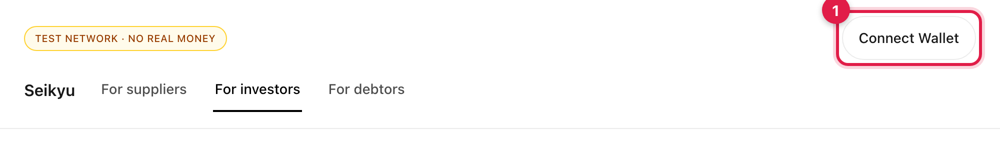

*ภาพที่ 1 — ปุ่ม Connect Wallet บนแถบเมนูด้านบน*

เมื่อเชื่อมต่อสำเร็จ ปุ่มจะเปลี่ยนเป็น address แบบย่อ เช่น `0x6013…C131`
ถ้าต้องการเปลี่ยนไปใช้ wallet อื่น ให้กดปุ่ม address นั้นหนึ่งครั้ง (เป็นการตัดการเชื่อมต่อ) แล้วเลือกบัญชีใหม่ใน MetaMask และกด **Connect Wallet** อีกครั้ง

### รับเหรียญทดสอบ mUSDC

1. ตรวจว่ามุมขวาบนแสดง address ของ wallet ที่ต้องการเติมเงิน
2. ที่หน้า **Home** กดปุ่ม **Get 10,000 mUSDC** แล้วกดยืนยันใน MetaMask — ปุ่มจะเปลี่ยนเป็น `Minting…` ระหว่างรอ

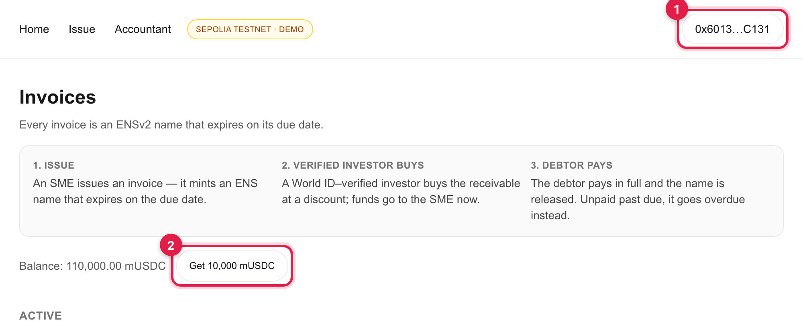

*ภาพที่ 2 — address ที่เชื่อมต่ออยู่ (1) และปุ่มขอ mUSDC (2)*

3. เมื่อธุรกรรมยืนยันแล้ว ยอด `Balance` ข้างปุ่มจะเพิ่มขึ้น 10,000 mUSDC (ในภาพจาก 100,000.00 เป็น 110,000.00)

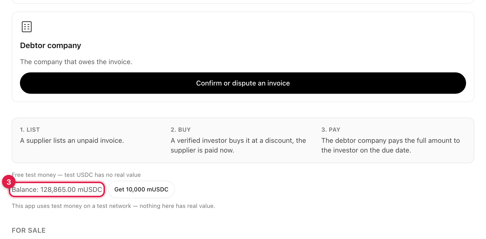

*ภาพที่ 3 — ยอด Balance หลังรับ mUSDC*

> **หมายเหตุ** mUSDC เป็นเหรียญจำลองบน testnet เท่านั้น ใครก็กดขอได้ ไม่มีมูลค่าจริง
> นักลงทุนต้องมี mUSDC พอสำหรับราคาซื้อ และลูกหนี้ต้องมีพอสำหรับยอดเต็มของ invoice

---

## บทที่ 1 ออก invoice (SME)

เชื่อมต่อ wallet ของ SME ก่อน แล้วกดเมนู **Issue** ด้านบน หน้า "Issue an invoice" จะเปิดขึ้น

1. ช่อง **Debtor address (取引先)** — ใส่ address ของลูกหนี้ (ผู้ที่ต้องจ่ายเงินตาม invoice)
2. ช่อง **Debtor accounts-payable address (取引先経理)** — ใส่ address ของฝ่ายบัญชีของลูกหนี้
   wallet นี้จะแก้ได้เพียงช่อง `ack` ช่องเดียว (ใต้ช่องเขียนว่า "This wallet may only set the ack record.")
3. ช่อง **Face value (mUSDC)** — ยอดเต็มที่ลูกหนี้ต้องจ่าย ในตัวอย่างคือ `1000`
4. ช่อง **Discount %** — ส่วนลดที่ให้นักลงทุน ในตัวอย่างคือ `5` ใต้ช่องจะคำนวณให้ดูทันทีว่า
   "Investor pays 950 mUSDC now for 1000 mUSDC at maturity."
5. หัวข้อ **Due date** — เลือกวันครบกำหนด ในตัวอย่างเลือก **+7 days**
   (มีตัวเลือก **+30 days**, **+10 minutes (demo expiry)** สำหรับสาธิตการหมดอายุ และ **Custom** สำหรับกำหนดวันเวลาเอง)
6. ตรวจกล่องสรุปด้านล่าง "Registers inv-3.seikyu.eth with expiry = …" — คือชื่อ ENS ที่ invoice นี้จะได้ และเวลาหมดอายุซึ่งเท่ากับวันครบกำหนด
7. กดปุ่ม **Issue invoice** แล้วกด Confirm ใน MetaMask

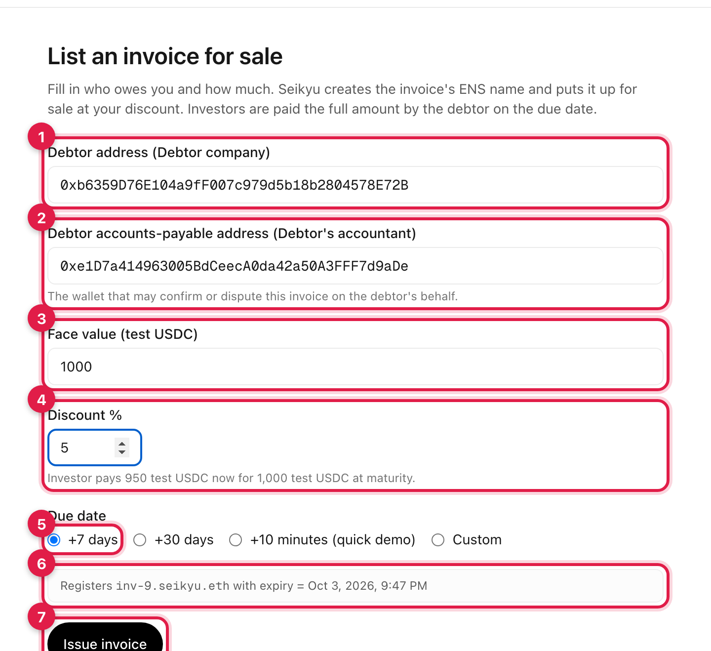

*ภาพที่ 4 — ฟอร์ม Issue an invoice ที่กรอกครบแล้ว*

8. หลังยืนยันใน MetaMask จะมีลิงก์ **View transaction →** ปรากฏ ใช้เปิดดูธุรกรรมบน block explorer ได้
9. ปุ่มจะเปลี่ยนเป็น `Confirm in wallet…` แล้วเป็น `Confirming…` ระหว่างรอ block — เมื่อยืนยันเสร็จ แอปจะพาไปหน้าของ invoice ใบใหม่เองโดยอัตโนมัติ

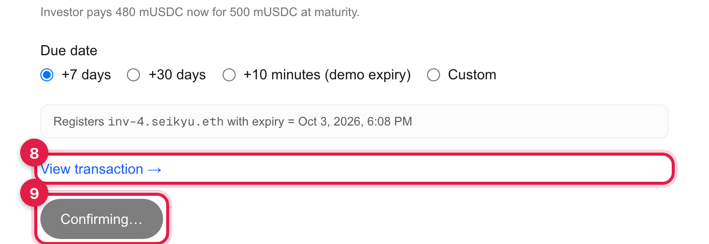

*ภาพที่ 5 — ระหว่างรอยืนยัน (ภาพนี้ถ่ายตอนออก invoice ใบที่สอง `inv-4.seikyu.eth` มูลค่า 500 mUSDC ซึ่งใช้ในบทที่ 6 — หน้าจอระหว่างรอของทุกใบเหมือนกัน)*

> **ทำไมกดไม่ผ่าน** แอปจะแสดงข้อความสีแดงเหนือปุ่มเมื่อ:
> address ลูกหนี้หรือฝ่ายบัญชีเป็น wallet ของคุณเอง ("Debtor cannot be your own connected wallet.") ·
> ไม่ได้ใส่ Face value · ส่วนลดทำให้ราคาเป็น 0 หรือเท่ากับยอดเต็ม · วันครบกำหนดน้อยกว่า 1 นาทีจากตอนนี้
> ถ้า wallet เป็น smart account (EIP-7702) ปุ่มจะกดไม่ได้และมีกล่องเตือนสีเหลือง (ดูภาคผนวก ข)

### อ่านหน้า invoice

หน้า invoice แสดงข้อมูลที่อ่านมาจาก blockchain โดยตรง

1. ชื่อ invoice บน ENS (`inv-3.seikyu.eth`) และลิงก์ **View on ENS app →**
2. ป้าย **SETTLEMENT (ON-CHAIN)** — สถานะทางการเงิน: `Open` คือประกาศขายอยู่และยังไม่มีผู้ซื้อ
3. ป้าย **ENS ACK** — สถานะการยืนยันจากฝ่ายบัญชีของลูกหนี้: `no ack` คือยังไม่ได้ยืนยัน (ป้ายนี้เป็นข้อมูลประกอบ ไม่ใช่การรับประกันการจ่ายเงิน)
4. บรรทัด "Name live on ENS: yes — expires in 6d 23h" — ชื่อยังใช้งานได้ และนับถอยหลังถึงวันครบกำหนด
5. ตาราง **ENS RECORDS** 8 รายการ ได้แก่ `amount` (หน่วยเป็นทศนิยม 6 ตำแหน่ง: `1000000000` = 1,000 mUSDC), `currency`, `debtor`, `dueDate` (เวลาแบบ Unix), `status` (`listed`), `ack`, `tokenId`, `issuer` และบรรทัด Resolver ที่เก็บข้อมูลของ invoice ใบนี้

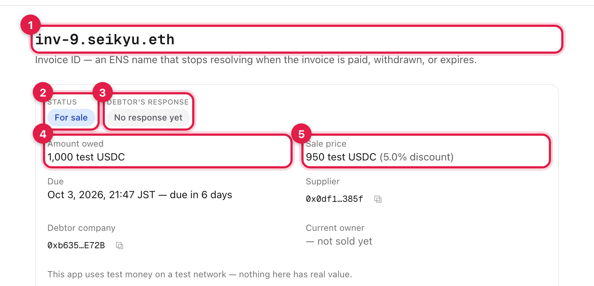

*ภาพที่ 6 — ส่วนบนของหน้า invoice หลังออกสำเร็จ*

เลื่อนลงมาที่หัวข้อ **SETTLEMENT**

6. **Price** — ราคาที่นักลงทุนต้องจ่าย (950.00 mUSDC)
7. **Due date** — วันครบกำหนด
8. **State** — `Listed` คือรอผู้ซื้อ
9. **Holder** — ผู้ถือ invoice ตอนนี้ ขณะยังไม่มีผู้ซื้อ token จะอยู่ในสัญญา InvoiceMarket (`0x9Cf9…B875`) ซึ่งทำหน้าที่ escrow
10. กล่องสำหรับนักลงทุน — ปุ่ม **Verify with World ID** (บทที่ 2) หรือปุ่มซื้อ (บทที่ 3)
11. ปุ่ม **Cancel invoice** — เห็นเฉพาะ wallet ผู้ออก invoice และเฉพาะตอนที่ยังไม่มีผู้ซื้อ (บทที่ 6)

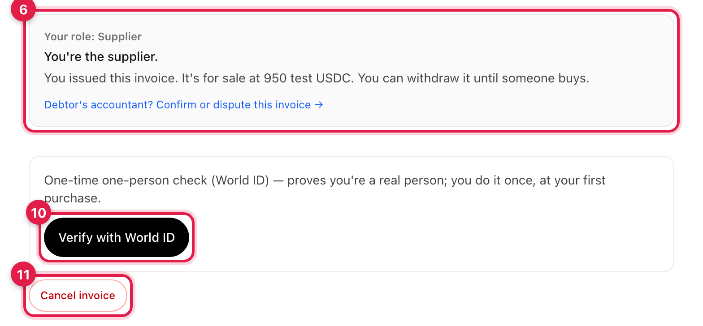

*ภาพที่ 7 — ส่วน Settlement และปุ่มสำหรับนักลงทุน/ผู้ออก invoice*

> **หมายเหตุ** ส่งลิงก์หน้า invoice หรือชื่อ ENS ให้นักลงทุนและฝ่ายบัญชีของลูกหนี้ได้เลย ทุกคนเปิดหน้าเดียวกัน
> แต่ปุ่มที่เห็นจะต่างกันตาม wallet ที่เชื่อมต่ออยู่

---

## บทที่ 2 ยืนยันตัวตนด้วย World ID (นักลงทุน)

ก่อนซื้อ invoice ได้ นักลงทุนต้องพิสูจน์ด้วย World ID ว่าเป็นมนุษย์ที่ไม่ซ้ำกับใคร

> **credential ที่ใช้** ระบบจริง (production) ออกแบบให้ใช้ credential แบบ **Passport** ซึ่งรับประกันความไม่ซ้ำในระดับเอกสาร (พาสปอร์ตหนึ่งเล่มต่อหนึ่ง wallet)
> แต่ใน World ID Simulator ของ staging นั้น Passport เป็นเอกสารจำลองชุดเดียวที่ทุก identity ใช้ร่วมกัน (ได้ nullifier เดียวกันเสมอ)
> ซึ่งถูกผูกกับ wallet อื่นไปแล้ว — เวอร์ชัน demo จึงตั้งค่าเป็น **Proof of Human** (ปุ่ม **Human** ใน Simulator, `NEXT_PUBLIC_WORLD_PRESET=proofOfHuman`)
> ภาพในบทนี้ถ่ายจากเวอร์ชัน demo ข้อความในกล่องซื้อของแอปยังเขียนว่า "World ID Passport proof" ตามการออกแบบของระบบจริง

ทำครั้งเดียวต่อ wallet และระบบผูก "หนึ่งคนต่อหนึ่ง wallet" — คนเดียวกันใช้ wallet ที่สองยืนยันซ้ำไม่ได้ (ดูบทที่ 6.4)
นักลงทุนหนึ่งคนถือ invoice ที่ยังไม่ปิดได้สูงสุด 3 ใบ

- **Staging (ช่วงทดสอบ, ภาพในคู่มือนี้)** ใช้ World ID Simulator บนเว็บ `simulator.worldcoin.org` แทนมือถือ
- **Production (ระบบจริง)** ใช้แอป World App บนมือถือสแกน QR code ในหน้าต่างเดียวกัน แล้วกดยืนยันในแอป ขั้นตอนที่เหลือเหมือนกัน

เชื่อมต่อ wallet ของนักลงทุน แล้วเปิดหน้า invoice ที่ต้องการซื้อ

1. ในกล่องด้านล่างที่เขียนว่า "Buying a receivable requires a World ID Passport proof …" กดปุ่ม **Verify with World ID**

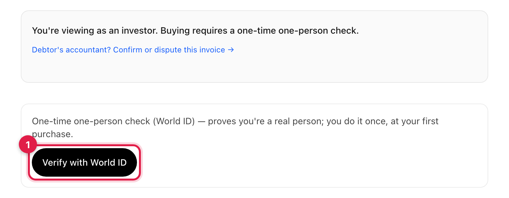

*ภาพที่ 8 — กล่องซื้อของนักลงทุนที่ยังไม่ได้ยืนยันตัวตน*

2. หน้าต่าง "Connect your World ID" จะเปิดขึ้น
   - staging: กดลิงก์ **Use the simulator** ใต้ QR code (ข้อความ "Testing in staging?") — Simulator จะเปิดในแท็บใหม่
   - production: เปิด World App บนมือถือแล้วสแกน QR code

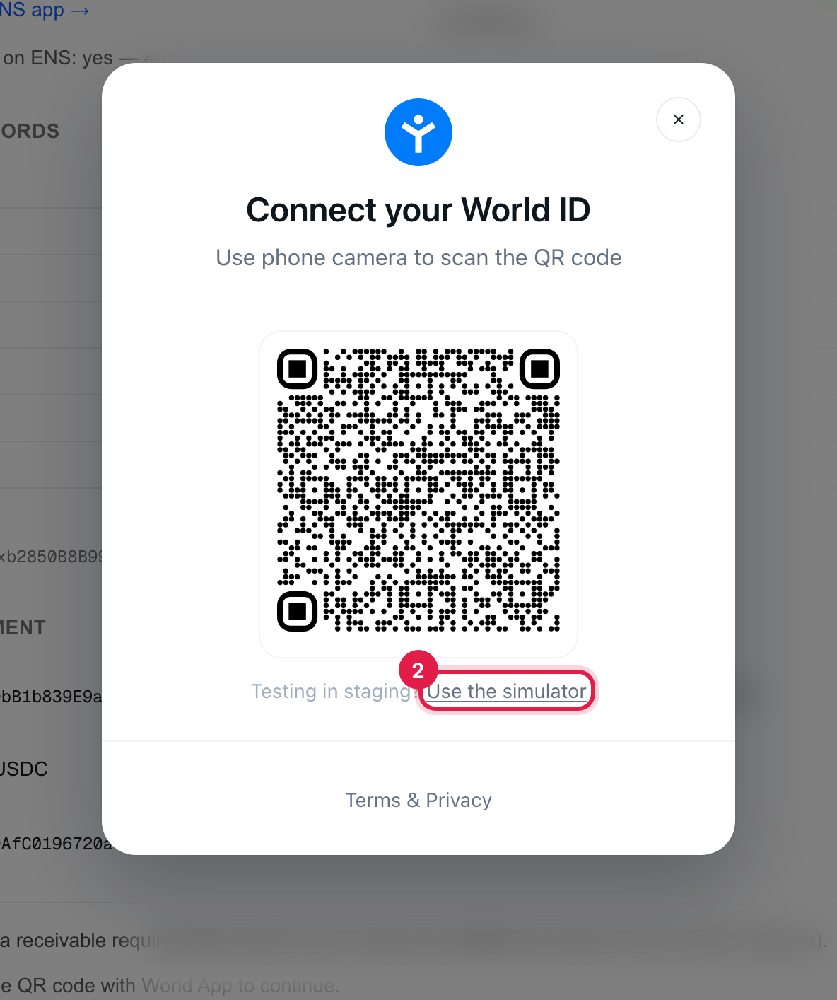

*ภาพที่ 9 — หน้าต่าง World ID และลิงก์ Use the simulator*

> **หมายเหตุ** ถ้าหน้าต่างเบราว์เซอร์แคบ (ประมาณต่ำกว่า 1,024 px) หน้าต่าง World ID จะเปลี่ยนเป็นแบบมือถือ
> มีเพียงปุ่ม "Open World ID App" และ "Display QR Code" โดยไม่มีลิงก์ Use the simulator — ให้ขยายหน้าต่างเบราว์เซอร์แล้วเปิดใหม่

3. ในแท็บ Simulator จะเห็นหน้า "Complete verification" ตรวจว่าปุ่ม **Human** มีกรอบ (ถูกเลือกไว้แล้ว) และด้านล่างเขียนว่า "Unique Human"
4. ที่หัวข้อ **SIMULATOR OPTIONS** ด้านล่าง กดเลือก **Legacy v3 proof** (สำคัญสำหรับ staging — ดูหมายเหตุด้านล่าง)
5. กดปุ่ม **Continue**

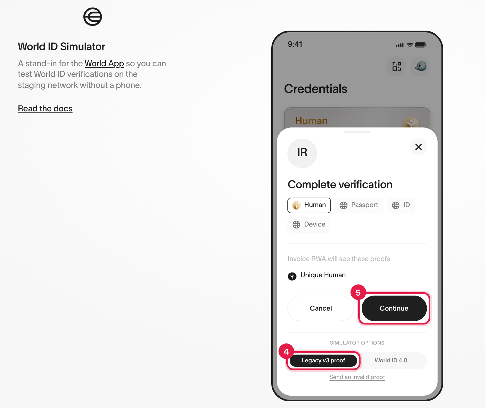

*ภาพที่ 10 — World ID Simulator: เลือก Legacy v3 proof (4) แล้วกด Continue (5)*

6. กลับมาที่แท็บ Seikyu ข้อความในกล่องจะเป็น "Verifying your World ID…" ระหว่างที่เซิร์ฟเวอร์ตรวจหลักฐานกับ World
   และบันทึกผลลง blockchain (ธุรกรรม `InvestorVerified`) — เมื่อเสร็จ ข้อความจะเป็น "Verified with World ID."
   และภายในไม่กี่วินาทีกล่องจะเปลี่ยนเป็นราคาพร้อมปุ่ม **Approve mUSDC** (บทที่ 3)

> **ทำไมต้องเลือก Legacy v3 proof (staging เท่านั้น)** ในโหมด "World ID 4.0" (ค่าเริ่มต้น) Simulator ส่งรหัสประจำตัว (nullifier)
> ค่าเดียวกันให้ **ทุก** identity และทุก credential — รหัสนั้นถูกผูกกับ wallet อื่นไปแล้ว ผลคือ `409 NULLIFIER_ALREADY_USED`
> ส่วนโหมด "Legacy v3 proof" ให้รหัสแยกตาม identity ของ Simulator จึงยืนยัน wallet ใหม่ได้ (ถ้า identity นั้นยังไม่เคยใช้ — ดูภาคผนวก ข)
> ระบบจริง (World App) ไม่มีตัวเลือกนี้และไม่มีปัญหานี้

---

## บทที่ 3 ซื้อ receivable (นักลงทุน)

หลังยืนยันตัวตนแล้ว (บทที่ 2) กล่องซื้อในหน้า invoice จะแสดงราคาและปุ่มสำหรับซื้อ การซื้อมี 2 ธุรกรรม: อนุญาตให้ตลาดดึง mUSDC แล้วจึงซื้อ

1. บรรทัด "Price 950.00 mUSDC (5.0% discount)" — ราคาที่จะจ่ายและส่วนลดจากยอดเต็ม
2. กดปุ่ม **Approve mUSDC** แล้วกด Confirm ใน MetaMask — เป็นการอนุญาตให้สัญญา InvoiceMarket ดึง mUSDC เท่ากับราคาซื้อ
   ระหว่างรอจะมีข้อความ `Approving mUSDC…`

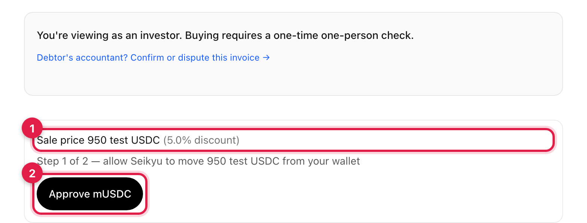

*ภาพที่ 11 — ราคาและปุ่ม Approve mUSDC หลังยืนยันตัวตนแล้ว*

3. เมื่ออนุญาตเสร็จ ปุ่มจะเปลี่ยนเป็น **Buy for 950.00 mUSDC** กดปุ่มนี้แล้วกด Confirm ใน MetaMask (ระหว่างรอขึ้น `Buying…`)

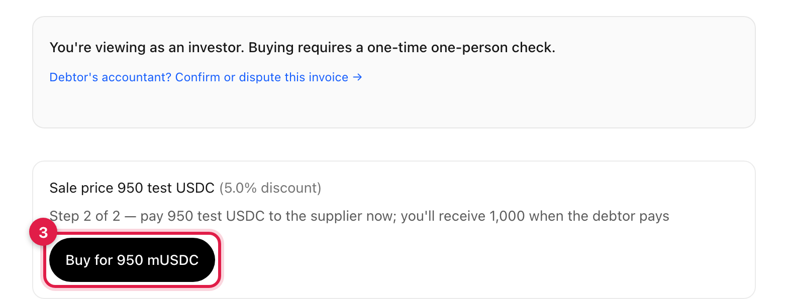

*ภาพที่ 12 — ปุ่มซื้อ*

เมื่อซื้อสำเร็จ SME ได้รับ 950 mUSDC ทันที และหน้า invoice จะอัปเดตเอง (ถ้ายังไม่เปลี่ยน ให้รีเฟรชหน้า)

4. ป้าย **SETTLEMENT (ON-CHAIN)** เปลี่ยนเป็น `Funded`
5. record `status` ใน ENS เปลี่ยนจาก `listed` เป็น `funded` (ป้าย ENS ACK ในภาพเป็น `acknowledged` เพราะฝ่ายบัญชียืนยันไว้ก่อนแล้วตามบทที่ 4)

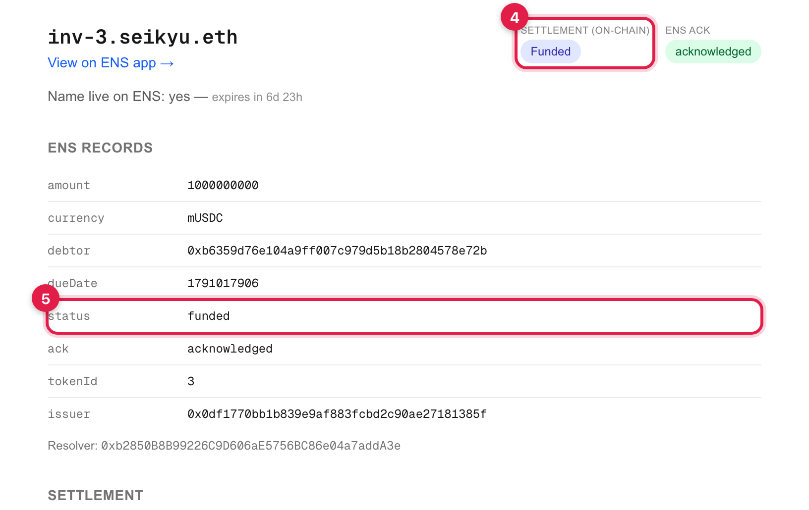

*ภาพที่ 13 — invoice เปลี่ยนเป็น Funded*

6. **State** เป็น `Funded`
7. **Holder** เป็น address ของนักลงทุน (`0x6013…C131`) — นักลงทุนถือ invoice (token ERC-721) และจะได้รับยอดเต็ม 1,000 mUSDC เมื่อลูกหนี้จ่าย
   กล่องด้านล่างเปลี่ยนเป็นกล่องชำระเงินสำหรับลูกหนี้ (บทที่ 5)

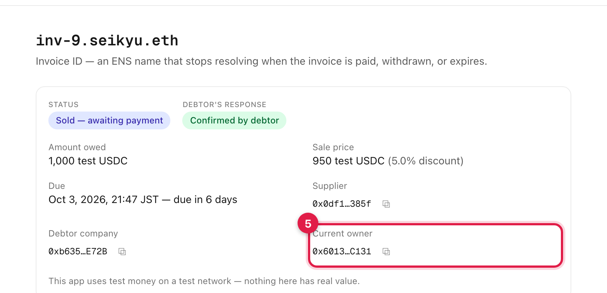

*ภาพที่ 14 — ผู้ถือ invoice คือนักลงทุน*

> **ถ้าซื้อไม่ได้** กล่องจะแสดงเหตุผลเป็นตัวแดง เช่น "You already hold the maximum of 3 open positions." (ถือครบ 3 ใบแล้ว),
> "This invoice's ENS name is no longer live, so it can't be bought." (ชื่อหมดอายุแล้ว),
> "This invoice's due date has passed." หรือข้อความ disputed (บทที่ 6.3)

---

## บทที่ 4 ฝ่ายบัญชีของลูกหนี้ยืนยันหรือโต้แย้ง invoice

ฝ่ายบัญชีของลูกหนี้ (accounts-payable, 取引先経理) คือ wallet ที่ SME ใส่ไว้ในช่องที่ 2 ตอนออก invoice
wallet นี้ได้สิทธิ์แก้ข้อมูลของ invoice เพียงช่องเดียวคือ `ack` ซึ่งมีค่าได้ 3 แบบ

- `acknowledged` — ยืนยันว่า invoice นี้มีจริงและถูกต้อง นักลงทุนมั่นใจขึ้น
- `disputed` — โต้แย้ง invoice ระบบจะ **ไม่ยอมให้ใครซื้อ invoice นี้เพิ่ม** จนกว่าจะเปลี่ยนกลับ
- ค่าว่าง (ปุ่ม **Clear**) — ยังไม่แสดงความเห็น

ทำได้ทุกเมื่อก่อน invoice ปิด ในตัวอย่างนี้ฝ่ายบัญชียืนยันก่อนที่นักลงทุนจะซื้อ

เชื่อมต่อ wallet ของฝ่ายบัญชี แล้วกดเมนู **Accountant** (หรือเปิดลิงก์ `/accountant?name=inv-3.seikyu.eth` ซึ่งกรอกชื่อ invoice ให้แล้ว)

1. กล่อง "Connected wallet: …" — ตรวจว่าเป็น address ฝ่ายบัญชีที่ SME ระบุไว้ (wallet อื่นจะกดได้แต่ธุรกรรมจะไม่ผ่าน)
2. ช่อง **Invoice name** — พิมพ์ชื่อ invoice เช่น `inv-3.seikyu.eth` ตาราง ENS RECORDS ของ invoice นั้นจะแสดงขึ้นมา
3. แถว **ack (editable)** ที่ไฮไลต์สีเหลือง — ช่องเดียวที่ wallet นี้แก้ได้
4. ปุ่ม **Acknowledge** — ยืนยัน invoice
5. ปุ่ม **Dispute** — โต้แย้ง invoice
6. ปุ่ม **Clear** — ล้างค่ากลับเป็นว่าง

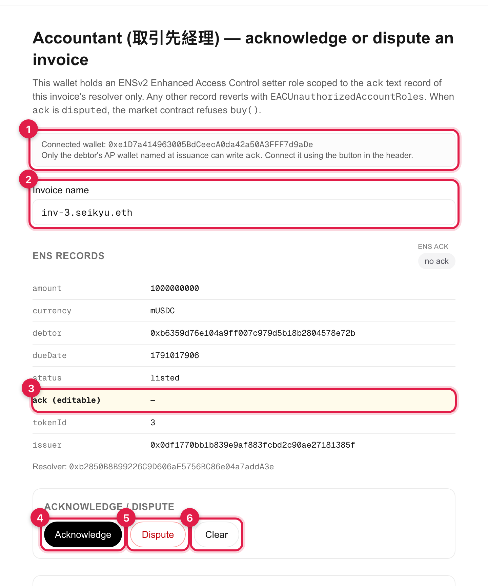

*ภาพที่ 15 — หน้า Accountant ของ inv-3.seikyu.eth ก่อนยืนยัน*

### ทดลองแก้ช่องอื่น (ทำไมแก้ยอดเงินไม่ได้)

ด้านล่างมีกล่อง **EAC NEGATIVE DEMO — EVERY OTHER RECORD IS OUT OF REACH** สำหรับพิสูจน์ว่าฝ่ายบัญชีแก้ช่องอื่นไม่ได้

7. ปุ่ม **Try to edit amount** — ลองแก้ยอดเงินของ invoice
8. ปุ่ม **Try to edit status** — ลองแก้สถานะของ invoice

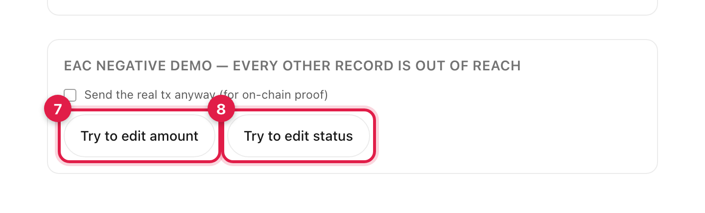

*ภาพที่ 16 — ปุ่มทดลองแก้ช่อง amount และ status*

9. หลังกด **Try to edit amount** จะมีกล่องสีแดง
   "amount: reverted with EACUnauthorizedAccountRoles — this wallet's EAC role is scoped to "ack" only."
   การกดปุ่มนี้เป็นการจำลองธุรกรรมเท่านั้น ไม่เสียค่า gas (ถ้าต้องการหลักฐานบน chain ให้ติ๊ก "Send the real tx anyway (for on-chain proof)" ก่อน)

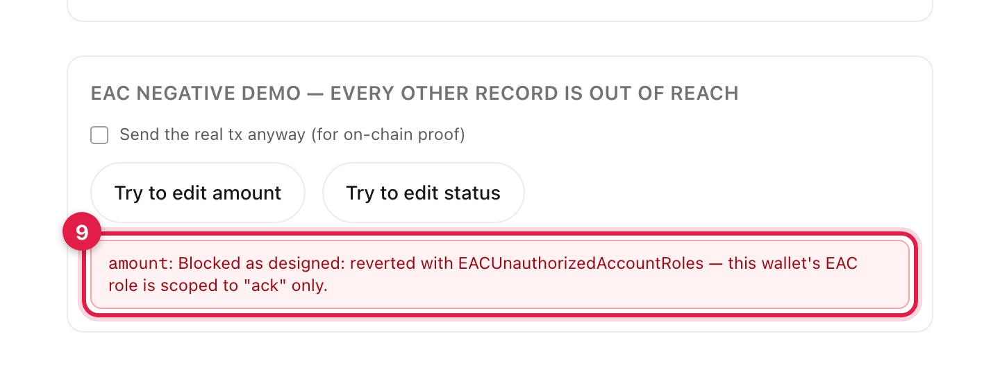

*ภาพที่ 17 — ระบบปฏิเสธการแก้ amount*

> **ทำไมแก้ไม่ได้** แต่ละ invoice มี resolver ของ ENS แยกเป็นของตัวเอง และใช้ระบบสิทธิ์ของ ENSv2 ที่เรียกว่า
> Enhanced Access Control (EAC) ตอนออก invoice สัญญาจะให้สิทธิ์ wallet ฝ่ายบัญชีแก้ได้เฉพาะช่อง `ack` ของ invoice ใบนั้น
> การแก้ช่องอื่นจึงถูก blockchain ปฏิเสธด้วย `EACUnauthorizedAccountRoles` — ลูกหนี้จึงแอบลดยอดหนี้ของตัวเองไม่ได้

### ยืนยัน invoice

กดปุ่ม **Acknowledge** (ข้อ 4) แล้วกด Confirm ใน MetaMask ระหว่างรอจะมีข้อความ `Confirm in wallet…` / `Confirming…`

10. เมื่อสำเร็จ ป้าย **ENS ACK** เปลี่ยนเป็น `acknowledged` และมีข้อความสีเขียว "ack updated." กับลิงก์ **View transaction →**
11. แถว `ack (editable)` ในตารางแสดงค่า `acknowledged`

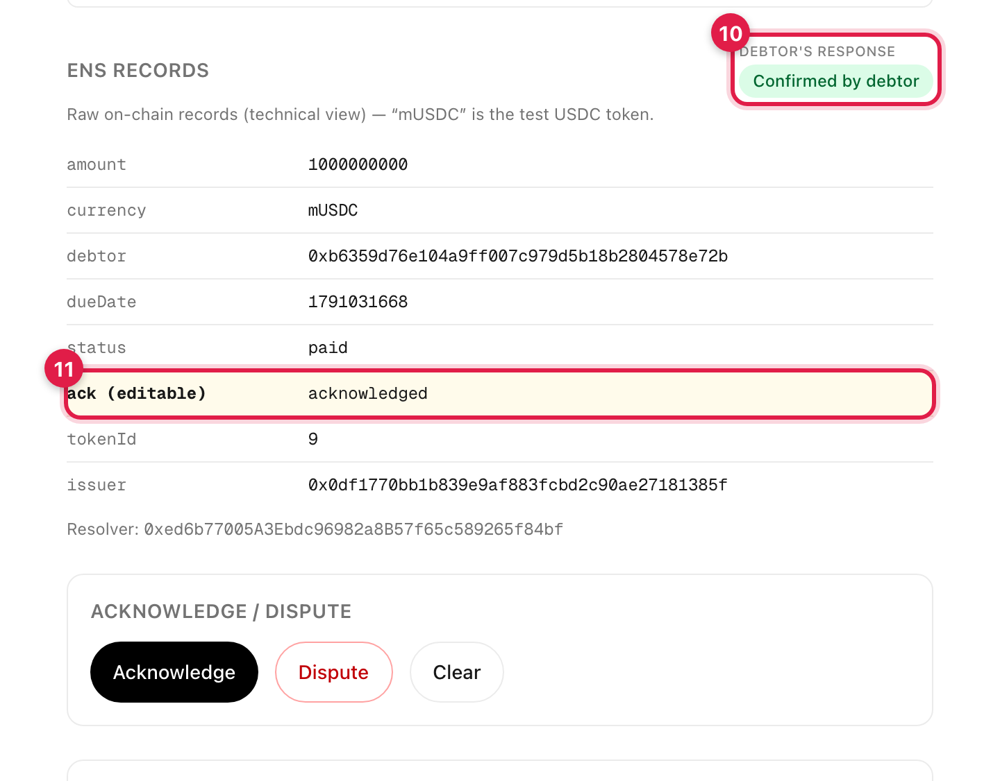

*ภาพที่ 18 — invoice ได้รับการยืนยันแล้ว*

### โต้แย้ง invoice (Dispute)

ตัวอย่างนี้ใช้ invoice ใบที่สอง `inv-4.seikyu.eth`: กดปุ่ม **Dispute** แล้วกด Confirm ใน MetaMask

1. ป้าย **ENS ACK** เปลี่ยนเป็น `disputed` (สีแดง)
2. แถว `ack (editable)` แสดง `disputed`
3. ข้อความ "ack updated." ยืนยันว่าบันทึกแล้ว

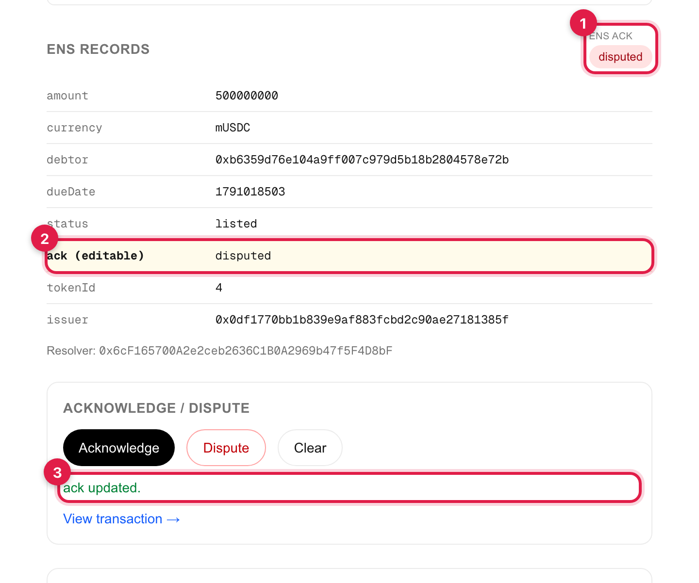

*ภาพที่ 19 — invoice ถูกโต้แย้ง*

> **ผลของ disputed** ตราบใดที่ `ack` เป็น `disputed` สัญญา InvoiceMarket จะปฏิเสธการซื้อ **ครั้งใหม่** ทั้งหมด (ดูบทที่ 6.3)
> ถ้า invoice ถูกซื้อไปก่อนแล้ว การโต้แย้งภายหลังไม่ได้ยกเลิกการซื้อนั้น แต่เป็นสัญญาณเตือนให้ผู้ถือ invoice ทราบ
> ถ้าเคลียร์ปัญหากันได้แล้ว ฝ่ายบัญชีกด **Acknowledge** หรือ **Clear** เพื่อเปิดให้ซื้อได้อีกครั้ง

---

## บทที่ 5 ลูกหนี้ชำระเงิน (settle) และชื่อ ENS ถูกถอน

เมื่อถึงกำหนด ลูกหนี้จ่ายยอดเต็มผ่านหน้า invoice เงินจะไปถึงผู้ถือ invoice (นักลงทุน) โดยตรง
ใครจะเป็นคนกดจ่ายก็ได้ แต่ปกติคือ wallet ของลูกหนี้ ซึ่งต้องมี mUSDC เท่ากับยอดเต็ม

เชื่อมต่อ wallet ของลูกหนี้ แล้วเปิดหน้า invoice ที่สถานะเป็น `Funded`

1. บรรทัด "Face value 1,000.00 mUSDC — held by 0x6013…C131" — ยอดที่ต้องจ่ายและผู้ที่จะได้รับเงิน
2. กดปุ่ม **Approve mUSDC** แล้วกด Confirm ใน MetaMask — อนุญาตให้ตลาดดึง mUSDC เท่ากับยอดเต็ม (ระหว่างรอขึ้น `Approving mUSDC…`)

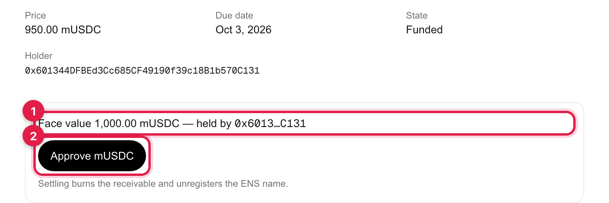

*ภาพที่ 20 — กล่องชำระเงินของลูกหนี้*

3. ปุ่มจะเปลี่ยนเป็น **Settle (pay 1,000.00 mUSDC)** กดแล้วกด Confirm ใน MetaMask (ระหว่างรอขึ้น `Settling…`)
   ใต้ปุ่มเตือนไว้ว่า "Settling burns the receivable and unregisters the ENS name."

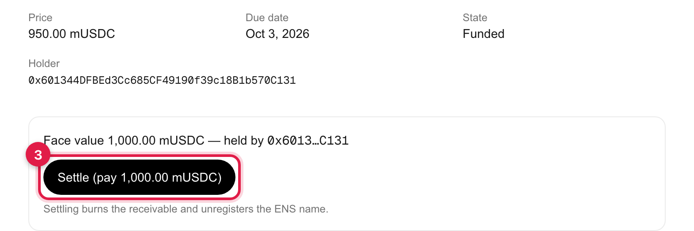

*ภาพที่ 21 — ปุ่ม Settle*

เมื่อธุรกรรมสำเร็จ นักลงทุนได้รับ 1,000 mUSDC token ของ invoice ถูกทำลาย (burn) และชื่อ ENS ถูกถอนทันทีในธุรกรรมเดียวกัน
รีเฟรชหน้า invoice จะเห็น

4. ป้าย **SETTLEMENT (ON-CHAIN)** เป็น `Paid`
5. "Name live on ENS: no — expired" — ชื่อ `inv-3.seikyu.eth` ไม่ resolve แล้ว แม้ยังไม่ถึงวันครบกำหนด
6. record `status` เป็น `paid` — ข้อมูลเดิมยังอ่านย้อนหลังได้จาก resolver ของ invoice และด้านล่างของหน้าแสดงข้อความ
   "This receivable has been settled in full."

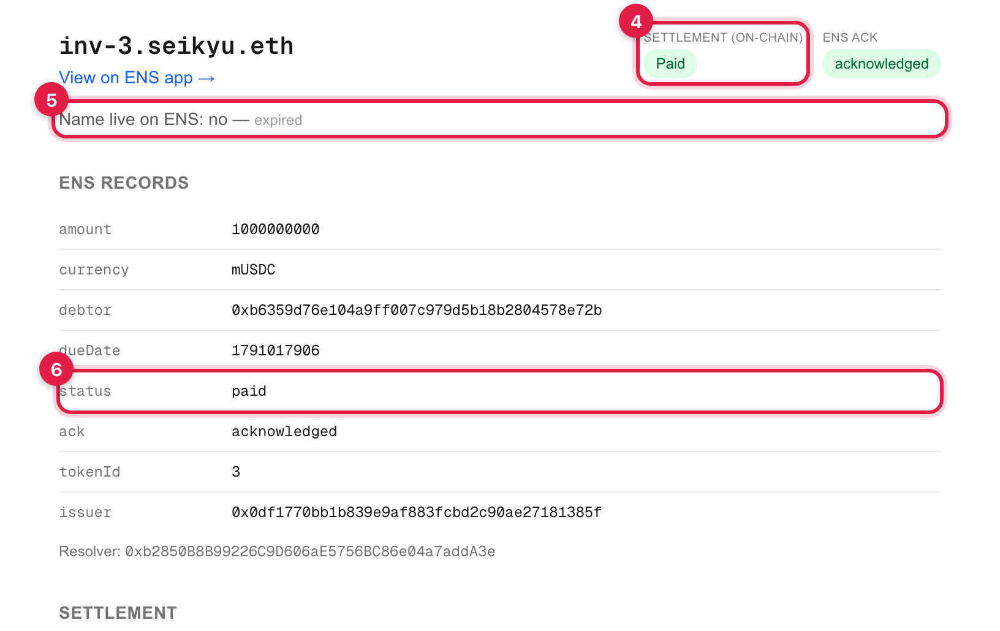

*ภาพที่ 22 — invoice ชำระครบและชื่อ ENS ถูกถอน*

> **หมายเหตุ** หลังชำระแล้ว ช่อง Holder ในส่วน SETTLEMENT จะแสดง "— unsold" เพราะ token ถูกทำลายไปแล้ว
> ไม่ได้แปลว่า invoice ไม่เคยถูกขาย (เป็นข้อความของแอปที่ยังไม่ได้แยกกรณีนี้)

---

## บทที่ 6 กรณีพิเศษ

### 6.1 ปิดหน้าต่าง World ID กลางคัน (F1)

ถ้านักลงทุนปิดหน้าต่าง "Connect your World ID" (กดปุ่ม ×) ก่อนยืนยันเสร็จ จะไม่มีอะไรเสียหาย
กล่องซื้อจะแสดงข้อความสีแดง "Verification cancelled — only verified investors can buy receivables."

1. กดปุ่ม **Retry** เพื่อเปิดหน้าต่าง World ID ใหม่ แล้วทำตามบทที่ 2 ต่อจากข้อ 2

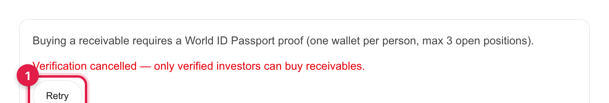

*ภาพที่ 23 — ยกเลิกการยืนยัน World ID แล้วกด Retry ได้*

### 6.2 ผู้ออกยกเลิก invoice

SME ยกเลิก invoice ได้เฉพาะตอนที่ยังไม่มีผู้ซื้อ (State เป็น `Listed`) ตัวอย่างนี้ใช้ `inv-4.seikyu.eth`

1. เชื่อมต่อ wallet ของ SME เปิดหน้า invoice แล้วกดปุ่ม **Cancel invoice** (ปุ่มขอบแดงใต้กล่องซื้อ) และกด Confirm ใน MetaMask — ปุ่มเปลี่ยนเป็น `Cancelling…`

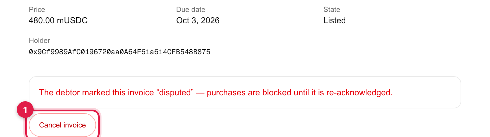

*ภาพที่ 24 — ปุ่ม Cancel invoice (มองเห็นเฉพาะผู้ออก invoice)*

2. เมื่อสำเร็จ ป้าย **SETTLEMENT (ON-CHAIN)** เปลี่ยนเป็น `Cancelled`
3. ชื่อ ENS ถูกถอนทันที บรรทัดสถานะเปลี่ยนเป็น "Name live on ENS: no — expired"

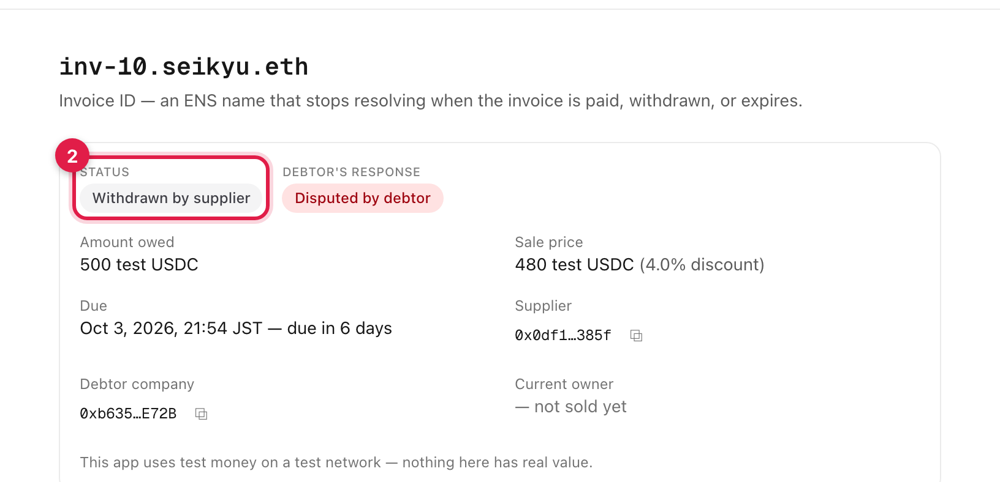

*ภาพที่ 25 — invoice ถูกยกเลิก*

ส่วนล่างของหน้าแสดง State `Cancelled`, Holder `— unsold` และข้อความ "The issuer cancelled this invoice before it was sold."

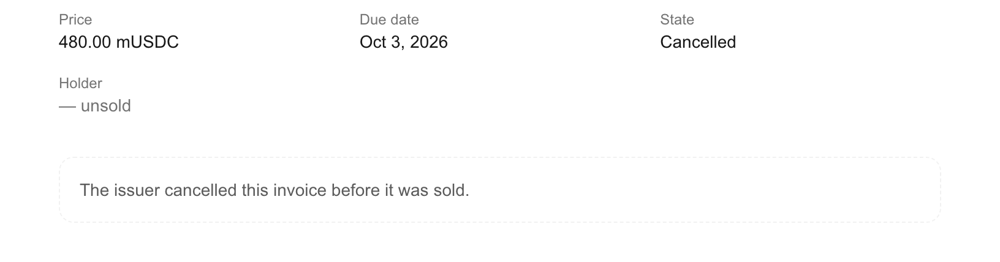

*ภาพที่ 26 — ไม่มีปุ่มซื้อหลังยกเลิก*

> **หมายเหตุ** ถ้ามีผู้ซื้อไปแล้ว การยกเลิกจะไม่ผ่าน (ข้อความ "Cancel failed — the invoice may already be sold.")

### 6.3 invoice ที่ถูกโต้แย้งซื้อไม่ได้

เมื่อฝ่ายบัญชีของลูกหนี้กด **Dispute** (บทที่ 4) นักลงทุนที่เปิดหน้า invoice นั้นจะเห็น

1. ป้าย **ENS ACK** เป็น `disputed`

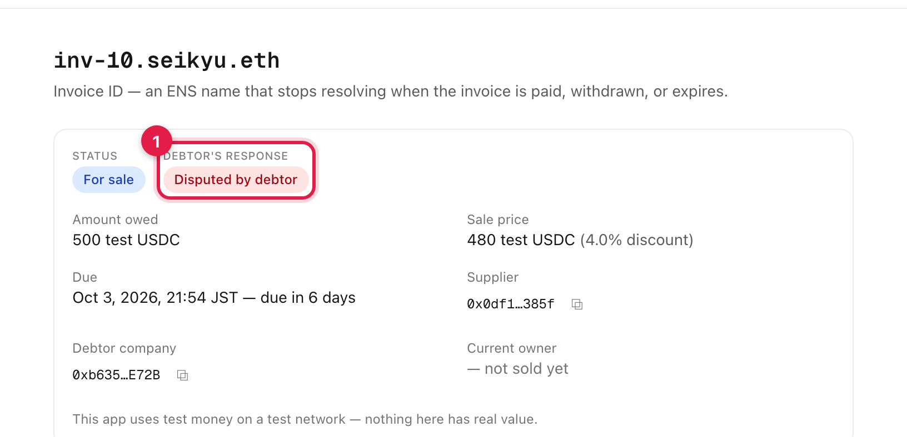

*ภาพที่ 27 — ป้าย disputed บนหน้า invoice*

2. กล่องซื้อไม่มีปุ่มใด ๆ มีเพียงข้อความสีแดง "The debtor marked this invoice “disputed” — purchases are blocked until it is re-acknowledged."

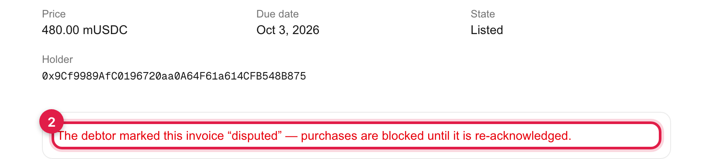

*ภาพที่ 28 — การซื้อถูกปิดจนกว่าจะได้รับการยืนยันใหม่*

การปิดนี้ไม่ได้อยู่แค่บนหน้าเว็บ สัญญา InvoiceMarket อ่านค่า `ack` จาก ENS ทุกครั้งที่มีการซื้อ และปฏิเสธด้วย `PurchaseBlockedByAck` ถ้าเป็น `disputed`

### 6.4 คนเดียวกันใช้ wallet ที่สอง (409)

World ID ให้รหัสประจำตัวแบบไม่ระบุตัวตน (nullifier) ที่ผูกกับ "คน" ไม่ใช่กับ wallet
เมื่อ wallet แรกยืนยันสำเร็จ รหัสนี้จะถูกบันทึกบน blockchain ว่าเป็นของ wallet นั้น
ถ้าคนเดิมเชื่อมต่อ wallet ที่สองแล้วทำบทที่ 2 ซ้ำ เซิร์ฟเวอร์จะตอบกลับ `409 NULLIFIER_ALREADY_USED`
และกล่องซื้อจะแสดง "This World ID is already linked to 0x… One investor wallet per person." พร้อมปุ่ม **Retry**

1. ข้อความสีแดงบอก address ของ wallet ที่ผูกกับ World ID นี้ไว้แล้ว
2. ปุ่ม **Retry** — กดซ้ำด้วย World ID เดิมจะได้ผลเหมือนเดิม

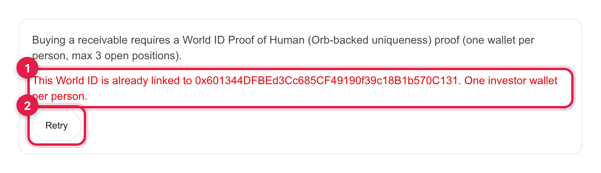

*ภาพที่ 29 — นักลงทุน A2 (`0xC919…D9c8`) ใช้ World ID เดียวกับนักลงทุน A จึงถูกปฏิเสธ*

ให้กลับไปใช้ wallet เดิมที่ยืนยันไว้แล้ว — ถ้าจำเป็นต้องย้าย wallet จริง ต้องให้ผู้ดูแลระบบ (owner ของสัญญา) ยกเลิกการผูกเดิมก่อน

### 6.5 ครบกำหนดแล้วยังขายไม่ได้ (Expired-unsold)

ชื่อ ENS ของ invoice หมดอายุเองในวันครบกำหนด ถ้าถึงวันนั้นยังไม่มีผู้ซื้อ invoice จะอยู่ในสถานะ `Expired-unsold`
ตัวอย่างคือ `inv-2.seikyu.eth` ซึ่งออกด้วยตัวเลือก **+10 minutes (demo expiry)**

1. ป้าย **SETTLEMENT (ON-CHAIN)** เป็น `Expired-unsold`
2. บรรทัดสถานะเป็น "Name live on ENS: no — expired" — ชื่อ ENS ไม่ resolve แล้ว
3. แต่ข้อมูลในตาราง ENS RECORDS ยังอ่านได้ครบ (เช่น `status` ยังเป็น `listed`) เพราะเก็บไว้ใน resolver ของ invoice ใบนั้น

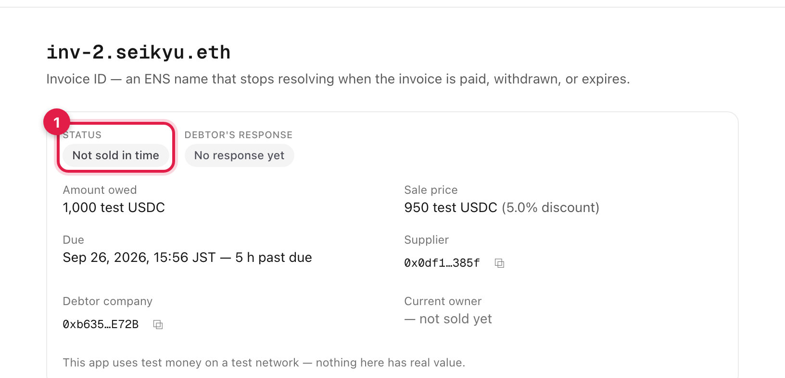

*ภาพที่ 30 — inv-2.seikyu.eth หลังครบกำหนดโดยไม่มีผู้ซื้อ*

4. กล่องด้านล่างไม่มีปุ่มซื้อ มีข้อความ "Not sold before the due date — the ENS name stopped resolving; records remain readable through the invoice's resolver."
   ในหน้า **Home** invoice แบบนี้จะอยู่ในหมวด **ATTENTION**

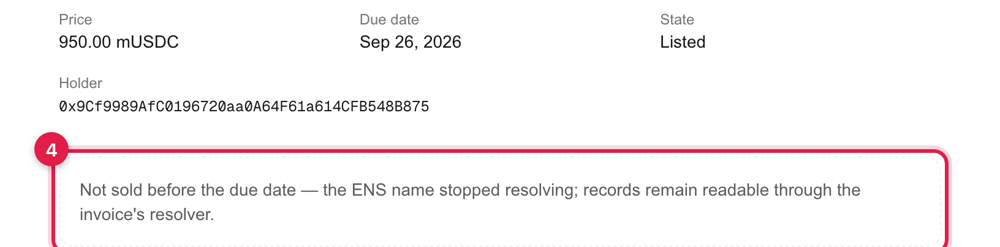

*ภาพที่ 31 — ไม่มีการซื้อขายหลังหมดอายุ*

### 6.6 เลยกำหนดแต่ยังไม่จ่าย (Overdue และปุ่ม Mark overdue)

ถ้า invoice ถูกซื้อแล้ว (`Funded`) แต่ลูกหนี้ยังไม่จ่ายเมื่อเลยวันครบกำหนด ชื่อ ENS จะหมดอายุตามปกติ และป้ายสถานะจะเป็น `Overdue`
กล่องสีเหลืองจะขึ้นว่า "Past due — the ENS name has expired; anyone can call markOverdue() to revive it with status=overdue."

1. กดปุ่ม **Mark overdue** (ใครกดก็ได้) แล้วกด Confirm ใน MetaMask — ปุ่มเปลี่ยนเป็น `Marking…` แล้วเป็น `Marked overdue`
2. ผลคือชื่อ ENS ถูกต่ออายุอีก 30 วันพร้อม record `status = overdue` เพื่อให้คนภายนอกเห็นบน ENS ว่า invoice นี้ค้างชำระ
3. ลูกหนี้ยังจ่ายได้ตามบทที่ 5 ตามปกติ — กล่องชำระเงินยังอยู่ใต้กล่องสีเหลือง

ส่วนนี้ไม่มีภาพประกอบ เพราะต้องรอให้ invoice ที่ถูกซื้อแล้วเลยกำหนดจริง ซึ่งไม่เกิดขึ้นระหว่างการถ่ายคู่มือ
(ข้อความและชื่อปุ่มข้างต้นคัดลอกจากหน้าจอของแอป)

---

## ภาคผนวก ก ที่อยู่สัญญาและลิงก์ (Sepolia)

| รายการ | Address |
|---|---|
| InvoiceMarket | [`0x9Cf9989AfC0196720aa0A64F61a614CFB548B875`](https://eth-sepolia.blockscout.com/address/0x9Cf9989AfC0196720aa0A64F61a614CFB548B875) |
| InvoiceRegistrar | [`0x628701e9A322B019e4aFe31A077f393644D748eF`](https://eth-sepolia.blockscout.com/address/0x628701e9A322B019e4aFe31A077f393644D748eF) |
| mUSDC (MockUSDC) | [`0x6B41ADF3e9A858136C28dfAC2432Eb2356E5451D`](https://eth-sepolia.blockscout.com/address/0x6B41ADF3e9A858136C28dfAC2432Eb2356E5451D) |
| UserRegistry (ENSv2 ของ `seikyu.eth`) | [`0xA9DFC9d1D5EA96b5Ade09d0E9B84944965B4eD67`](https://eth-sepolia.blockscout.com/address/0xA9DFC9d1D5EA96b5Ade09d0E9B84944965B4eD67) |
| ชื่อแม่ (parent name) | `seikyu.eth` |
| ENS app (Sepolia) | `https://sepolia.app.ens.domains/<ชื่อ invoice>` |
| World ID Simulator | https://simulator.worldcoin.org |

wallet ตัวอย่างที่ใช้ในคู่มือ

| บทบาท | Address |
|---|---|
| SME (ผู้ออก invoice) | `0x0df1770bB1b839E9aF883FcBD2C90ae27181385f` |
| นักลงทุน A | `0x601344DFBEd3Cc685CF49190f39c18B1b570C131` |
| นักลงทุน A2 (wallet ที่สองของคนเดิม) | `0xC91913F3eCDef9D30816C5D2d424142f3ABfD9c8` |
| ลูกหนี้ | `0xb6359D76E104a9fF007c979d5b18b2804578E72B` |
| ฝ่ายบัญชีของลูกหนี้ | `0xe1D7a414963005BdCeecA0da42a50A3FFF7d9aDe` |

ธุรกรรมจริงที่เกิดขึ้นระหว่างถ่ายภาพคู่มือ (เปิดดูบน Blockscout)

| ขั้นตอน | ธุรกรรม |
|---|---|
| ออก invoice `inv-3.seikyu.eth` (CREATE) | [`0xb5195264…e5aac7`](https://eth-sepolia.blockscout.com/tx/0xb5195264ea0f584d8719cf3f6dd9739d626966f51286aaeba8274cc460e5aac7) |
| ฝ่ายบัญชียืนยัน `ack=acknowledged` (ACK) | [`0x7e68a92b…bce791`](https://eth-sepolia.blockscout.com/tx/0x7e68a92bde64eb7a50d09c4c447492be289de476d952bf0a3b6e80cad6bce791) |
| ยืนยัน World ID ของนักลงทุน A (`InvestorVerified`, VERIFY) | [`0xde353f1a…00a38c`](https://eth-sepolia.blockscout.com/tx/0xde353f1a30fdf850010d72aadb34a5c194bee5128ad1e39e17803e392400a38c) |
| นักลงทุน A อนุญาต mUSDC | [`0x347cb0a0…85bdc2`](https://eth-sepolia.blockscout.com/tx/0x347cb0a08a6b80c4658f824540e0d8bbf7d982a5aa813cc33b54d09d2c85bdc2) |
| นักลงทุน A ซื้อ (BUY) | [`0x0d7925a9…ef382a`](https://eth-sepolia.blockscout.com/tx/0x0d7925a9cf6312b838db157d5f8d8751ad131f0cf5301befae6ac4022eef382a) |
| ลูกหนี้อนุญาต mUSDC | [`0x63768f28…19de10`](https://eth-sepolia.blockscout.com/tx/0x63768f285573c5ebdc72b8d7488d071f55168ae651a08a7514d66bc2ec19de10) |
| ลูกหนี้ชำระ (SETTLE) — token burn และถอนชื่อ ENS | [`0x5137876e…2de9cb`](https://eth-sepolia.blockscout.com/tx/0x5137876ee18d97cd1967685922c1f9842e0ce7319d92f36b583d9d50212de9cb) |
| ออก invoice ใบที่สอง `inv-4.seikyu.eth` | [`0x9f6997c1…d4c0c8`](https://eth-sepolia.blockscout.com/tx/0x9f6997c1bd22c8d07d8803b4eb95145495cf6471a747ed2eb1492dc0c4d4c0c8) |
| ฝ่ายบัญชีโต้แย้ง `inv-4` (`ack=disputed`) | [`0x2f470b24…869068`](https://eth-sepolia.blockscout.com/tx/0x2f470b242bf22a6b151a670f3d20b932135198ed8b8d480a7f98bebfbd869068) |
| SME ยกเลิก `inv-4` | [`0xb1c8d9fd…d2a1b1`](https://eth-sepolia.blockscout.com/tx/0xb1c8d9fd0c6d9e7115f920ccc70d86f3315f92d52c211175822d4d13b8d2a1b1) |

> **หมายเหตุ** ลิงก์ **View transaction →** และลิงก์ address ในแอปเปิดไปที่ Etherscan ส่วนตารางนี้ใช้ Blockscout
> ซึ่งแสดง source code ของสัญญาครบทั้งสามตัว

## ภาคผนวก ข คำถามที่พบบ่อย

**ทำไมยืนยัน World ID ไม่ผ่าน**

ดูข้อความสีแดงในกล่องซื้อ แล้วเทียบกับรายการนี้

- "This World ID is already linked to 0x… One investor wallet per person." (`409 NULLIFIER_ALREADY_USED`) — World ID นี้ผูกกับ wallet อื่นแล้ว
  ใช้ wallet เดิม หรือบน staging ให้สลับไปใช้ identity อื่นของ Simulator (ขั้นตอนด้านล่าง) และเลือก **Legacy v3 proof** ตามบทที่ 2
- "This credential doesn't match what this action requires. …" (`422 CREDENTIAL_MISMATCH`) — credential ที่ส่งมาไม่ตรงกับที่ระบบตั้งไว้
  ตรวจว่าเลือก **Human** ใน Simulator (หรือ credential ที่ World App ขอ)
- "Verification cancelled — …" — ปิดหน้าต่าง World ID ก่อนเสร็จ กด **Retry** (บทที่ 6.1)
- "Verification failed. Please try again." — ปัญหาฝั่งเซิร์ฟเวอร์หรือ World เช่น staging window ปิดอยู่ (ดูหัวข้อถัดไป) ลองใหม่ภายหลังหรือแจ้งผู้ดูแลระบบ
- ไม่เห็นลิงก์ **Use the simulator** — หน้าต่างเบราว์เซอร์แคบเกินไป (บทที่ 2 ข้อ 2) หรือระบบตั้งเป็น production ซึ่งต้องใช้ World App

**สลับ identity ใน World ID Simulator (staging)** — Simulator มี identity ทดสอบให้เลือก 5 ชุด (Identity #0 ถึง #4) ที่ทุกคนใช้ร่วมกัน
และกดปุ่ม **+** เพื่อสร้างเพิ่มได้

1. ในหน้าแรกของ Simulator กดรูปโปรไฟล์ (ปุ่ม Settings) มุมขวาบนของหน้าจอโทรศัพท์จำลอง
2. กด **Switch test identity**

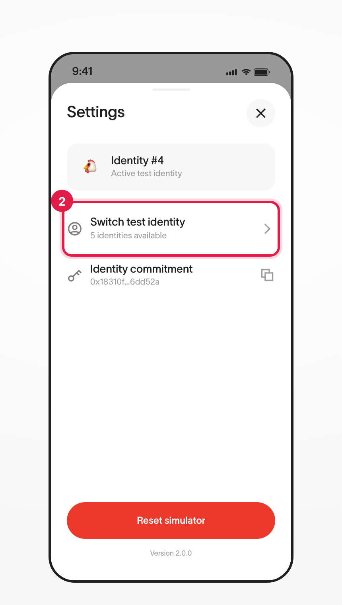

*ภาพที่ 32 — หน้า Settings ของ World ID Simulator*

3. กดเลือก identity ที่ต้องการ (ในภาพคือ Identity #1) — Simulator จะกลับไปหน้าแรกพร้อม identity ใหม่ จากนั้นเริ่มบทที่ 2 ใหม่ตั้งแต่ข้อ 1

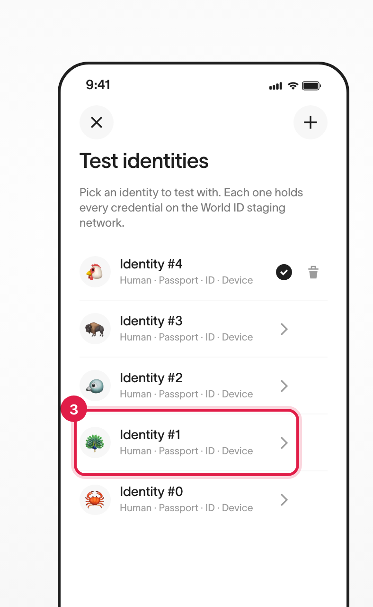

*ภาพที่ 33 — เลือก identity ทดสอบ*

**Staging window คืออะไร**
ช่วงทดสอบ (staging) World ID จะรับหลักฐานจาก Simulator ก็ต่อเมื่อเจ้าของแอปเปิด "staging verification window" ไว้ใน World Developer Portal
และเซิร์ฟเวอร์ของแอปมีค่า `WORLD_STAGING_VERIFICATION_TOKEN` ถ้าไม่มี เซิร์ฟเวอร์จะตอบ `503 STAGING_TOKEN_MISSING` และการยืนยันจะขึ้นว่า "Verification failed. Please try again."
ติดต่อผู้ดูแลระบบให้เปิด window ใหม่ ระบบจริง (production) ไม่ต้องใช้ขั้นตอนนี้

**ทำไมห้ามใช้ smart account (EIP-7702) เป็นผู้ออก invoice**
ตอนออก invoice ระบบ ENS จะโอนชื่อ invoice ให้ผู้ออกในรูป token มาตรฐาน ERC-1155 ซึ่งจะล้มเหลว (`ERC1155InvalidReceiver`) ถ้า wallet นั้นมี code อยู่
MetaMask ที่เปิดโหมด smart account (EIP-7702) จะมี code ติดอยู่ หน้า **Issue** จึงแสดงกล่องเตือนสีเหลือง
"This account has smart-account (EIP-7702) code. …" และปิดปุ่ม **Issue invoice** — ให้ใช้บัญชี MetaMask ธรรมดาที่ไม่ได้อัปเกรด
(บทบาทอื่น เช่น นักลงทุนหรือลูกหนี้ ไม่มีข้อจำกัดนี้)

**ตัวเลขใน ENS RECORDS ไม่ตรงกับยอดเงิน**
`amount` เก็บเป็นจำนวนเต็มที่มีทศนิยม 6 ตำแหน่งแบบ USDC — `1000000000` คือ 1,000.00 mUSDC ส่วน `dueDate` เป็นเวลาแบบ Unix (วินาที)

**ป้าย ENS ACK เป็น acknowledged แปลว่าลูกหนี้จะจ่ายแน่นอนไหม**
ไม่ใช่ ป้ายนี้เป็นเพียงการยืนยันจากฝ่ายบัญชีที่ SME ระบุเอง ตลาดนี้เป็นแบบไม่มีสิทธิ์ไล่เบี้ย (non-recourse) — ถ้าลูกหนี้ไม่จ่าย ผู้ถือ invoice รับความเสี่ยงเอง
