# คู่มือการใช้งาน Seikyu (Invoice RWA)

Seikyu (請求) คือตลาดซื้อขาย "ใบแจ้งหนี้ที่ยังไม่ถึงกำหนดชำระ" (receivable) บน Ethereum Sepolia testnet
ผู้ประกอบการ (supplier) นำ invoice ที่ลูกค้ายังไม่จ่ายมาขายลดราคาให้นักลงทุนเพื่อรับเงินสดทันที
invoice แต่ละใบจะมีชื่อ ENS ของตัวเอง เช่น `inv-9.seikyu.eth` ซึ่ง **หมดอายุในวันครบกำหนดชำระ** พอดี

ภาพทุกภาพในคู่มือนี้ถ่ายจากการใช้งานจริงบน Sepolia (26 ก.ย. 2026) หลังหน้าเว็บถูกปรับให้ใช้ภาษาธรรมดา
(plain-language UI) โดยใช้ invoice ตัวอย่าง `inv-9.seikyu.eth`
ตัวเลขในกรอบสีแดงของแต่ละภาพตรงกับหมายเลขขั้นตอนในรายการที่อยู่เหนือภาพ

## ผู้ใช้ 4 บทบาท

| บทบาท | ทำอะไรในระบบ | เมนู |
|---|---|---|
| Supplier (ผู้ออก invoice) | ออก invoice, ยกเลิก invoice ที่ยังขายไม่ได้ | **For suppliers**, หน้า invoice |
| Investor (นักลงทุน) | ยืนยันตัวตนด้วย World ID แล้วซื้อ invoice ในราคาลด | **For investors**, หน้า invoice |
| Debtor's accountant (ฝ่ายบัญชีของลูกหนี้) | ยืนยัน (acknowledge) หรือโต้แย้ง (dispute) invoice | **For debtors** |
| Debtor company (ลูกหนี้) | จ่ายเงินเต็มจำนวนเมื่อถึงกำหนด (settle) | หน้า invoice |

ลำดับงานปกติ: Supplier ออก invoice → Investor ยืนยันตัวตนและซื้อ (supplier ได้เงินทันที) → Debtor company จ่ายเต็มจำนวนให้ผู้ถือ invoice → token ถูกทำลายและชื่อ ENS ถูกถอน
Debtor's accountant ยืนยันหรือโต้แย้งได้ทุกเมื่อระหว่างที่ invoice ยังไม่ปิด

---

## สิ่งที่ต้องมี

- เบราว์เซอร์บนคอมพิวเตอร์ที่ติดตั้ง **MetaMask** และตั้งเครือข่ายเป็น **Sepolia** (chain id 11155111)
  ถ้าเบราว์เซอร์ไม่มี wallet ปุ่มมุมขวาบนจะกดไม่ได้และขึ้นว่า **"No browser wallet found"**;
  ถ้า wallet ต่ออยู่แต่อยู่คนละเครือข่าย จะมีแถบสีเหลืองใต้เมนูขึ้นว่า **"Your wallet is on the wrong network"** พร้อมปุ่ม **Switch to Sepolia** และปุ่มทำธุรกรรมทุกปุ่มจะกดไม่ได้จนกว่าจะสลับเครือข่าย (ภาคผนวก ข)
- **Sepolia ETH** เล็กน้อยในทุก wallet ที่จะกดทำธุรกรรม (ใช้จ่ายค่า gas, ขอได้จาก Sepolia faucet ทั่วไป) — การออก invoice หนึ่งใบใช้ประมาณ 0.001 ETH
- เหรียญทดสอบ **test USDC** (สัญญาชื่อ mUSDC) สำหรับนักลงทุนและลูกหนี้ (ขอได้ในแอปด้วยปุ่ม **Get 10,000 mUSDC** ดูด้านล่าง) — ทุกหน้ามีข้อความเตือนว่า "This app uses test money on a test network — nothing here has real value."
- ลิงก์ของแอป: ลิงก์ demo ที่ประกาศไว้ใน `README.md` หรือรันในเครื่องด้วย `pnpm -C web dev` แล้วเปิด `http://localhost:3000`
  (ภาพในคู่มือนี้ถ่ายจากเซิร์ฟเวอร์ในเครื่อง)
- สำหรับนักลงทุน: บัญชี **World ID** — ช่วงทดสอบ (staging) ใช้ **World ID Simulator** บนเว็บได้เลยโดยไม่ต้องมีมือถือ
  ส่วนระบบจริง (production) ต้องใช้แอป **World App** ที่ยืนยันพาสปอร์ตแล้ว
- wallet ของ supplier ต้องเป็นบัญชี MetaMask ธรรมดา (EOA) **ห้ามเป็น smart account แบบ EIP-7702** (ดูภาคผนวก ข)

### เชื่อมต่อ wallet

1. กดปุ่ม **Connect Wallet** มุมขวาบน แล้วกดอนุมัติในหน้าต่าง MetaMask ที่เด้งขึ้นมา

*ภาพที่ 1 — ปุ่ม Connect Wallet บนแถบเมนูด้านบน (แถบสีเหลือง "Test network · no real money" อยู่แถวบน, เมนู Seikyu/For suppliers/For investors/For debtors อยู่แถวล่าง — หัวเว็บแบ่งเป็น 2 แถวเพื่อให้พอดีหน้าจอมือถือ)*

เมื่อเชื่อมต่อสำเร็จ ปุ่มจะเปลี่ยนเป็น address แบบย่อ เช่น `0x6013…C131`
ถ้าต้องการเปลี่ยนไปใช้ wallet อื่น ให้กดปุ่ม address นั้นหนึ่งครั้ง แอปจะถามยืนยัน **"Disconnect?"** พร้อมปุ่ม **Yes**/**No** — กด Yes เพื่อตัดการเชื่อมต่อ แล้วเลือกบัญชีใหม่ใน MetaMask และกด **Connect Wallet** อีกครั้ง

### รับเหรียญทดสอบ test USDC

1. ตรวจว่ามุมขวาบนแสดง address ของ wallet ที่ต้องการเติมเงิน
2. ที่หน้า **Home** ใต้กล่อง "How it works" มีบรรทัด **"Free test money — test USDC has no real value"** กดปุ่ม **Get 10,000 mUSDC** แล้วกดยืนยันใน MetaMask — ปุ่มจะเปลี่ยนเป็น `Minting…` ระหว่างรอ

*ภาพที่ 2 — address ที่เชื่อมต่ออยู่ (1) และปุ่มขอ test USDC (2)*

3. เมื่อธุรกรรมยืนยันแล้ว ยอด `Balance` ข้างปุ่มจะเพิ่มขึ้น 10,000 mUSDC

*ภาพที่ 3 — ยอด Balance หลังรับ test USDC*

> **หมายเหตุ** test USDC (ชื่อสัญญาเดิม mUSDC) เป็นเหรียญจำลองบน testnet เท่านั้น ใครก็กดขอได้ ไม่มีมูลค่าจริง
> นักลงทุนต้องมี test USDC พอสำหรับราคาซื้อ และลูกหนี้ต้องมีพอสำหรับยอดเต็มของ invoice

---

## บทที่ 1 ออก invoice (Supplier)

เชื่อมต่อ wallet ของ supplier ก่อน แล้วกดเมนู **For suppliers** ด้านบน หน้า "List an invoice for sale" จะเปิดขึ้น

1. ช่อง **Debtor address (Debtor company)** — ใส่ address ของลูกหนี้ (ผู้ที่ต้องจ่ายเงินตาม invoice)
2. ช่อง **Debtor accounts-payable address (Debtor's accountant)** — ใส่ address ของฝ่ายบัญชีของลูกหนี้
   ใต้ช่องเขียนว่า "The wallet that may confirm or dispute this invoice on the debtor's behalf."
3. ช่อง **Face value (test USDC)** — ยอดเต็มที่ลูกหนี้ต้องจ่าย ในตัวอย่างคือ `1000`
4. ช่อง **Discount %** — ส่วนลดที่ให้นักลงทุน ในตัวอย่างคือ `5` ใต้ช่องจะคำนวณให้ดูทันทีว่า
   "Investor pays 950 test USDC now for 1,000 test USDC at maturity."
5. หัวข้อ **Due date** — เลือกวันครบกำหนด ในตัวอย่างเลือก **+7 days**
   (มีตัวเลือก **+30 days**, **+10 minutes (quick demo)** สำหรับสาธิตการหมดอายุ/ค้างชำระ และ **Custom** สำหรับกำหนดวันเวลาเอง)
6. ตรวจกล่องสรุปด้านล่าง "Registers inv-9.seikyu.eth with expiry = …" — คือชื่อ ENS ที่ invoice นี้จะได้ และเวลาหมดอายุซึ่งเท่ากับวันครบกำหนด
7. กดปุ่ม **Issue invoice** แล้วกด Confirm ใน MetaMask

*ภาพที่ 4 — ฟอร์ม List an invoice for sale ที่กรอกครบแล้ว*

8. หลังยืนยันใน MetaMask จะมีลิงก์ **View transaction →** ปรากฏ ใช้เปิดดูธุรกรรมบน block explorer ได้
9. ปุ่มจะเปลี่ยนเป็น `Confirm in wallet…` แล้วเป็น `Confirming…` ระหว่างรอ block — เมื่อยืนยันเสร็จ แอปจะพาไปหน้าของ invoice ใบใหม่เองโดยอัตโนมัติ

*ภาพที่ 5 — ระหว่างรอยืนยัน (หน้าจอระหว่างรอเหมือนกันทุกใบ; ภาพนี้ถ่ายจากการออก invoice ตัวอย่างอีกใบหนึ่งเพื่อจับภาพช่วงเวลาสั้น ๆ นี้ให้ทัน)*

> **ทำไมกดไม่ผ่าน** แอปจะแสดงข้อความสีแดงเหนือปุ่มเมื่อ:
> address ลูกหนี้หรือฝ่ายบัญชีเป็น wallet ของคุณเอง ("Debtor cannot be your own connected wallet.") ·
> ไม่ได้ใส่ Face value · ส่วนลดทำให้ราคาเป็น 0 หรือเท่ากับยอดเต็ม · วันครบกำหนดน้อยกว่า 1 นาทีจากตอนนี้
> ถ้า wallet เป็น smart account (EIP-7702) จะมีกล่องเตือนสีเหลือง **"Smart-account wallets can't list invoices — please use a regular wallet address."** และปุ่ม Issue invoice กดไม่ได้ (ดูภาคผนวก ข)

### อ่านหน้า invoice

หน้า invoice แสดงข้อมูลที่อ่านมาจาก blockchain โดยตรง ตอนนี้แบ่งเป็นสามส่วน: การ์ดสรุปแบบภาษาธรรมดาด้านบน, กล่อง "บทบาทของคุณ" ตรงกลาง, และปุ่มสำหรับทำรายการด้านล่าง — รายละเอียดของ ENS ถูกซ่อนไว้ในกล่อง "Technical details" ที่พับปิดอยู่โดยปริยาย

1. ชื่อ invoice บน ENS (`inv-9.seikyu.eth`) พร้อมคำอธิบาย "Invoice ID — an ENS name that stops resolving when the invoice is paid, withdrawn, or expires."
2. ป้าย **STATUS** — สถานะทางการเงิน: `For sale` คือประกาศขายอยู่และยังไม่มีผู้ซื้อ
3. ป้าย **DEBTOR'S RESPONSE** — สถานะการยืนยันจากฝ่ายบัญชีของลูกหนี้: `No response yet` (ป้ายนี้เป็นข้อมูลประกอบ ไม่ใช่การรับประกันการจ่ายเงิน)
4. รายการ **Amount owed** (ยอดเต็ม) และ **Sale price** (ราคาขาย พร้อม % ส่วนลดถ้ามี)

*ภาพที่ 6 — ป้ายสถานะและยอดเงินของหน้า invoice หลังออกสำเร็จ*

ในกล่องเดียวกันยังมีรายการ **Due** (วันครบกำหนด แบบ absolute + relative เช่น "Oct 3, 2026, 21:47 JST — due in 6 days"), **Supplier**, **Debtor company**, **Current owner** (แสดง address แบบย่อพร้อมปุ่มคัดลอก ⧉ หรือ "— not sold yet" ถ้ายังไม่มีผู้ซื้อ) และบรรทัดเตือนเรื่อง test money ไว้ท้ายกล่อง

ใต้กล่องสรุปมีแถบ **"Technical details (ENS)"** ที่พับปิดอยู่โดยปริยาย

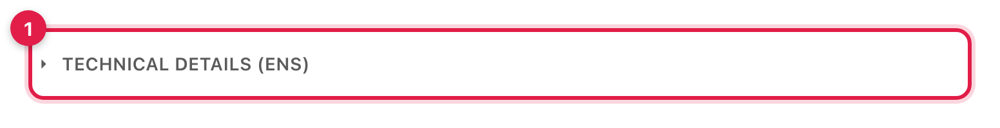

*ภาพที่ 7 — กล่อง Technical details (ENS) ปิดอยู่ตามค่าเริ่มต้น — กดที่แถบเพื่อเปิด*

กดที่แถบเพื่อเปิดดู:

5. ลิงก์ **View on ENS app →**
6. บรรทัด "Name live on ENS: yes/no — expires in …" — ชื่อยังใช้งานได้หรือไม่ และนับถอยหลังถึงวันหมดอายุ
7. ตาราง **ENS records** 8 รายการ ได้แก่ `amount` (หน่วยเป็นทศนิยม 6 ตำแหน่ง: `1000000000` = 1,000 test USDC), `currency`, `debtor`, `dueDate` (เวลาแบบ Unix), `status` (`listed`), `ack`, `tokenId`, `issuer` และบรรทัด Resolver ที่เก็บข้อมูลของ invoice ใบนี้

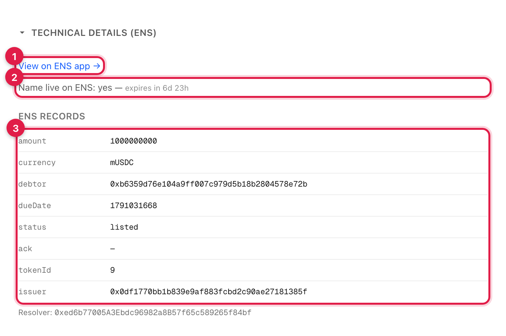

*ภาพที่ 8 — Technical details เปิดแล้ว: ลิงก์ View on ENS app (1), บรรทัด Name live on ENS (2), ตาราง ENS records ทั้ง 8 แถว (3)*

> **หมายเหตุ** เนื้อหาในกล่อง Technical details เป็นข้อมูลเดียวกับที่คู่มือรุ่นก่อนแสดงไว้บนหน้าเปิดตลอด — แค่ย้ายเข้ากล่องพับ เพื่อให้คนที่ไม่คุ้น web3 เห็นแต่ข้อมูลจำเป็นก่อน ถ้าเปิดลิงก์ที่มี `#ens` ต่อท้าย (เช่น `/invoice/inv-9.seikyu.eth#ens`) กล่องนี้จะเปิดให้อัตโนมัติ

เลื่อนลงมาที่กล่อง **"บทบาทของคุณ"** (role banner) ใต้การ์ดสรุป — เปลี่ยนข้อความตามที่ wallet ที่เชื่อมต่ออยู่เป็นใครในรายการนี้ (supplier / debtor company / current owner / ไม่มีบทบาท / ไม่ได้เชื่อมต่อ) พร้อมลิงก์ **"Debtor's accountant? Confirm or dispute this invoice →"** ไปหน้า Accountant เสมอ

8. กล่องสำหรับ supplier — ปุ่ม **Cancel invoice** (เห็นเฉพาะ wallet ผู้ออก invoice และเฉพาะตอนที่ยังไม่มีผู้ซื้อ; บทที่ 6)
9. กล่องสำหรับนักลงทุน — ปุ่ม **Verify with World ID** (บทที่ 2) หรือปุ่มซื้อ (บทที่ 3)

*ภาพที่ 9 — กล่องบทบาทของคุณ (6) และปุ่มสำหรับนักลงทุน/ผู้ออก invoice*

> **หมายเหตุ** ส่งลิงก์หน้า invoice หรือชื่อ ENS ให้นักลงทุนและฝ่ายบัญชีของลูกหนี้ได้เลย ทุกคนเปิดหน้าเดียวกัน
> แต่ปุ่มและข้อความในกล่องบทบาทจะต่างกันตาม wallet ที่เชื่อมต่ออยู่

---

## บทที่ 2 ยืนยันตัวตนด้วย World ID (นักลงทุน)

ก่อนซื้อ invoice ได้ นักลงทุนต้องพิสูจน์ด้วย World ID ว่าเป็นมนุษย์ที่ไม่ซ้ำกับใคร

> **credential ที่ใช้** ระบบจริง (production) ออกแบบให้ใช้ credential แบบ **Passport** ซึ่งรับประกันความไม่ซ้ำในระดับเอกสาร (พาสปอร์ตหนึ่งเล่มต่อหนึ่ง wallet)
> แต่ใน World ID Simulator ของ staging นั้น Passport เป็นเอกสารจำลองชุดเดียวที่ทุก identity ใช้ร่วมกัน (ได้ nullifier เดียวกันเสมอ)
> ซึ่งถูกผูกกับ wallet อื่นไปแล้ว — เวอร์ชัน demo จึงตั้งค่าเป็น **Proof of Human** (ปุ่ม **Human** ใน Simulator, `NEXT_PUBLIC_WORLD_PRESET=proofOfHuman`)
> ข้อความในกล่องซื้อจะบอก credential ที่ระบบตั้งไว้

> **หมายเหตุเรื่อง wallet ในภาพชุดนี้** นักลงทุนตัวอย่าง (A และ A2) ในคู่มือนี้ยืนยัน World ID สำเร็จไปแล้วตั้งแต่การถ่ายภาพครั้งก่อน — เมื่อ wallet ยืนยันสำเร็จครั้งหนึ่งแล้ว แอปจะไม่แสดงหน้ายืนยันให้เห็นอีก (ข้าม verify ไปที่ Approve/Buy ตรง ๆ) จึงไม่มี wallet ทั้งสองใบที่ยังไม่ยืนยันเหลือให้ถ่ายภาพหน้านี้ใหม่
> ภาพในบทนี้จึงถ่ายจาก wallet ของ **ฝ่ายบัญชีของลูกหนี้ (Debtor's accountant)** แทน — ใช้ wallet เดียวกันได้ทั้งสองบทบาทเพราะการยืนยัน World ID (investor) และสิทธิ์แก้ `ack` (accountant) เป็นระบบคนละส่วนกันโดยสิ้นเชิง หน้าจอที่เห็นจะเหมือนกันไม่ว่า wallet ไหนกด

ทำครั้งเดียวต่อ wallet และระบบผูก "หนึ่งคนต่อหนึ่ง wallet" — คนเดียวกันใช้ wallet ที่สองยืนยันซ้ำไม่ได้ (ดูบทที่ 6.4)
นักลงทุนหนึ่งคนถือ invoice ที่ยังไม่ปิดได้สูงสุด 3 ใบ

- **Staging (ช่วงทดสอบ, ภาพในคู่มือนี้)** ใช้ World ID Simulator บนเว็บ `simulator.worldcoin.org` แทนมือถือ
- **Production (ระบบจริง)** ใช้แอป World App บนมือถือสแกน QR code ในหน้าต่างเดียวกัน แล้วกดยืนยันในแอป ขั้นตอนที่เหลือเหมือนกัน

เชื่อมต่อ wallet ของนักลงทุน แล้วเปิดหน้า invoice ที่ต้องการซื้อ

1. ในกล่องบทบาท "You're viewing as an investor. Buying requires a one-time one-person check." ใต้ลงมาในกล่องทำรายการมีข้อความ "One-time one-person check (World ID) — proves you're a real person; you do it once, at your first purchase." กดปุ่ม **Verify with World ID**

*ภาพที่ 10 — กล่องซื้อของนักลงทุนที่ยังไม่ได้ยืนยันตัวตน*

2. หน้าต่าง "Connect your World ID" จะเปิดขึ้น
   - staging: กดลิงก์ **Use the simulator** ใต้ QR code (ข้อความ "Testing in staging?") — Simulator จะเปิดในแท็บใหม่
   - production: เปิด World App บนมือถือแล้วสแกน QR code

*ภาพที่ 11 — หน้าต่าง World ID และลิงก์ Use the simulator*

> **หมายเหตุ** ถ้าหน้าต่างเบราว์เซอร์แคบ (ประมาณต่ำกว่า 1,024 px) หน้าต่าง World ID จะเปลี่ยนเป็นแบบมือถือ
> มีเพียงปุ่ม "Open World ID App" และ "Display QR Code" โดยไม่มีลิงก์ Use the simulator — ให้ขยายหน้าต่างเบราว์เซอร์แล้วเปิดใหม่

3. ในแท็บ Simulator จะเห็นหน้า "Complete verification" ตรวจว่าปุ่ม **Human** มีกรอบ (ถูกเลือกไว้แล้ว) และด้านล่างเขียนว่า "Unique Human"
4. ที่หัวข้อ **SIMULATOR OPTIONS** ด้านล่าง กดเลือก **Legacy v3 proof** (สำคัญสำหรับ staging — ดูหมายเหตุด้านล่าง)
5. กดปุ่ม **Continue**

*ภาพที่ 12 — World ID Simulator: เลือก Legacy v3 proof (4) แล้วกด Continue (5)*

6. กลับมาที่แท็บ Seikyu ข้อความในกล่องจะเป็น "Verifying your World ID…" ระหว่างที่เซิร์ฟเวอร์ตรวจหลักฐานกับ World
   และบันทึกผลลง blockchain (ธุรกรรม `InvestorVerified`) — เมื่อเสร็จ ข้อความจะเป็น **"Verified with World ID."**

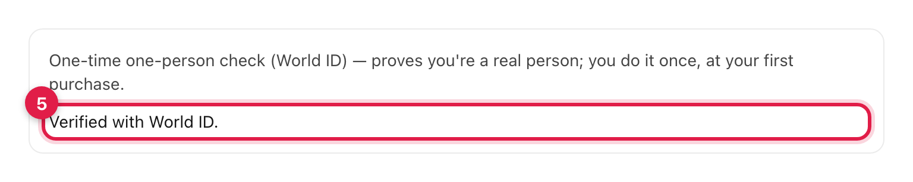

*ภาพที่ 13 — ยืนยันสำเร็จ*

7. ภายในไม่กี่วินาทีกล่องจะเปลี่ยนเป็นราคาพร้อมปุ่ม **Approve mUSDC** (บทที่ 3)

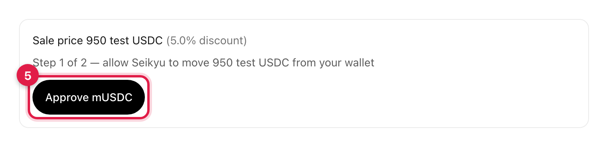

*ภาพที่ 14 — กล่องซื้อหลังยืนยันตัวตนสำเร็จ*

> **ทำไมต้องเลือก Legacy v3 proof (staging เท่านั้น)** ในโหมด "World ID 4.0" (ค่าเริ่มต้น) Simulator ส่งรหัสประจำตัว (nullifier)
> ค่าเดียวกันให้ **ทุก** identity และทุก credential — รหัสนั้นถูกผูกกับ wallet อื่นไปแล้ว ผลคือ `409 NULLIFIER_ALREADY_USED`
> ส่วนโหมด "Legacy v3 proof" ให้รหัสแยกตาม identity ของ Simulator จึงยืนยัน wallet ใหม่ได้ (ถ้า identity นั้นยังไม่เคยใช้ — ดูภาคผนวก ข)
> ระบบจริง (World App) ไม่มีตัวเลือกนี้และไม่มีปัญหานี้

---

## บทที่ 3 ซื้อ receivable (นักลงทุน)

หลังยืนยันตัวตนแล้ว (บทที่ 2) กล่องซื้อในหน้า invoice จะแสดงราคาและปุ่มสำหรับซื้อ การซื้อมี 2 ธุรกรรม: อนุญาตให้ตลาดดึง test USDC แล้วจึงซื้อ
ภาพในบทนี้กลับมาใช้นักลงทุน A (`0x6013…C131`) ซึ่งยืนยันตัวตนไว้แล้วจากก่อนหน้านี้ — กล่องซื้อจึงข้ามตรงไปที่ราคาและปุ่ม Approve/Buy เลย เหมือนกับที่ผู้ใช้จริงเห็นหลังยืนยันครั้งเดียว

1. บรรทัด "Sale price 950 test USDC (5.0% discount)" — ราคาที่จะจ่ายและส่วนลดจากยอดเต็ม พร้อมข้อความ "Step 1 of 2 — allow Seikyu to move 950 test USDC from your wallet"
2. กดปุ่ม **Approve mUSDC** แล้วกด Confirm ใน MetaMask — เป็นการอนุญาตให้สัญญา InvoiceMarket ดึง test USDC เท่ากับราคาซื้อ
   ระหว่างรอจะมีข้อความ `Approving mUSDC…`

*ภาพที่ 15 — ราคาและปุ่ม Approve mUSDC หลังยืนยันตัวตนแล้ว*

3. เมื่ออนุญาตเสร็จ ข้อความเปลี่ยนเป็น "Step 2 of 2 — pay 950 test USDC to the supplier now; you'll receive 1,000 when the debtor pays" และปุ่มจะเปลี่ยนเป็น **Buy for 950 mUSDC** กดปุ่มนี้แล้วกด Confirm ใน MetaMask (ระหว่างรอขึ้น `Buying…`)

*ภาพที่ 16 — ปุ่มซื้อ*

เมื่อซื้อสำเร็จ supplier ได้รับ 950 test USDC ทันที และหน้า invoice จะอัปเดตเอง (ถ้ายังไม่เปลี่ยน ให้รีเฟรชหน้า)

4. ป้าย **STATUS** เปลี่ยนเป็น `Sold — awaiting payment`

*ภาพที่ 17 — invoice เปลี่ยนเป็น Sold — awaiting payment*

5. รายการ **Current owner** ในการ์ดสรุปเปลี่ยนเป็น address ของนักลงทุน (`0x6013…C131`) — นักลงทุนถือ invoice (token ERC-721) และจะได้รับยอดเต็ม 1,000 test USDC เมื่อลูกหนี้จ่าย
   กล่องบทบาทและกล่องทำรายการด้านล่างเปลี่ยนเป็นกล่องชำระเงินสำหรับลูกหนี้ (บทที่ 5)

*ภาพที่ 18 — Current owner คือนักลงทุนที่ซื้อ*

> **ถ้าซื้อไม่ได้** กล่องจะแสดงเหตุผลเป็นตัวแดง เช่น "You already own 3 open invoices — the maximum per person." (ถือครบ 3 ใบแล้ว),
> "This invoice is no longer for sale (its ENS name expired)." (ชื่อหมดอายุแล้ว),
> "This invoice's due date has passed." หรือ "The debtor disputed this invoice, so it can't be bought." (บทที่ 6.3)

---

## บทที่ 4 ฝ่ายบัญชีของลูกหนี้ยืนยันหรือโต้แย้ง invoice

Debtor's accountant (accounts-payable) คือ wallet ที่ supplier ใส่ไว้ในช่องที่ 2 ตอนออก invoice
wallet นี้ได้สิทธิ์แก้ข้อมูลของ invoice เพียงช่องเดียวคือ `ack` ซึ่งมีค่าได้ 3 แบบ

- `acknowledged` — ยืนยันว่า invoice นี้มีจริงและถูกต้อง นักลงทุนมั่นใจขึ้น
- `disputed` — โต้แย้ง invoice ระบบจะ **ไม่ยอมให้ใครซื้อ invoice นี้เพิ่ม** จนกว่าจะเปลี่ยนกลับ
- ค่าว่าง (ปุ่ม **Clear**) — ยังไม่แสดงความเห็น

ทำได้ทุกเมื่อก่อน invoice ปิด ในตัวอย่างนี้ฝ่ายบัญชียืนยันก่อนที่นักลงทุนจะซื้อ

เชื่อมต่อ wallet ของฝ่ายบัญชี แล้วกดเมนู **For debtors** (หรือเปิดลิงก์ `/accountant?name=inv-9.seikyu.eth` ซึ่งกรอกชื่อ invoice ให้แล้ว)

1. กล่อง "Connected wallet: …" — ตรวจว่าเป็น address ฝ่ายบัญชีที่ supplier ระบุไว้ (wallet อื่นจะกดได้แต่ธุรกรรมจะไม่ผ่าน)
2. ช่อง **Invoice name** — พิมพ์ชื่อ invoice เช่น `inv-9.seikyu.eth` ตาราง ENS records ของ invoice นั้นจะแสดงขึ้นมา
3. แถว **ack (editable)** ที่ไฮไลต์สีเหลือง — ช่องเดียวที่ wallet นี้แก้ได้
4. ปุ่ม **Acknowledge** — ยืนยัน invoice
5. ปุ่ม **Dispute** — โต้แย้ง invoice
6. ปุ่ม **Clear** — ล้างค่ากลับเป็นว่าง

*ภาพที่ 19 — หน้า Debtor's accountant ของ inv-9.seikyu.eth ก่อนยืนยัน*

### ทดลองแก้ช่องอื่น (ทำไมแก้ยอดเงินไม่ได้)

ด้านล่างมีกล่อง **"EAC negative demo — every other record is out of reach"** สำหรับพิสูจน์ว่าฝ่ายบัญชีแก้ช่องอื่นไม่ได้

7. ปุ่ม **Try to edit amount** — ลองแก้ยอดเงินของ invoice
8. ปุ่ม **Try to edit status** — ลองแก้สถานะของ invoice

*ภาพที่ 20 — ปุ่มทดลองแก้ช่อง amount และ status*

9. หลังกด **Try to edit amount** จะมีกล่องสีแดง
   "Blocked as designed: reverted with EACUnauthorizedAccountRoles — this wallet's EAC role is scoped to "ack" only."
   การกดปุ่มนี้เป็นการจำลองธุรกรรมเท่านั้น ไม่เสียค่า gas (ถ้าต้องการหลักฐานบน chain ให้ติ๊ก "Send the real tx anyway (for on-chain proof)" ก่อน)

*ภาพที่ 21 — ระบบปฏิเสธการแก้ amount*

> **ทำไมแก้ไม่ได้** แต่ละ invoice มี resolver ของ ENS แยกเป็นของตัวเอง และใช้ระบบสิทธิ์ของ ENSv2 ที่เรียกว่า
> Enhanced Access Control (EAC) ตอนออก invoice สัญญาจะให้สิทธิ์ wallet ฝ่ายบัญชีแก้ได้เฉพาะช่อง `ack` ของ invoice ใบนั้น
> การแก้ช่องอื่นจึงถูก blockchain ปฏิเสธด้วย `EACUnauthorizedAccountRoles` — ลูกหนี้จึงแอบลดยอดหนี้ของตัวเองไม่ได้

### ยืนยัน invoice

กดปุ่ม **Acknowledge** (ข้อ 4) แล้วกด Confirm ใน MetaMask ระหว่างรอจะมีข้อความ `Confirm in wallet…` / `Confirming…`

10. เมื่อสำเร็จ ป้าย **DEBTOR'S RESPONSE** เปลี่ยนเป็น `Confirmed by debtor` และมีข้อความสีเขียว "ack updated." กับลิงก์ **View transaction →**
11. แถว `ack (editable)` ในตารางแสดงค่า `acknowledged`

*ภาพที่ 22 — invoice ได้รับการยืนยันแล้ว*

### โต้แย้ง invoice (Dispute)

ตัวอย่างนี้ใช้ invoice ใบที่สอง `inv-10.seikyu.eth`: กดปุ่ม **Dispute** แล้วกด Confirm ใน MetaMask

1. ป้าย **DEBTOR'S RESPONSE** เปลี่ยนเป็น `Disputed by debtor` (สีแดง)
2. แถว `ack (editable)` แสดง `disputed`
3. ข้อความ "ack updated." ยืนยันว่าบันทึกแล้ว

*ภาพที่ 23 — invoice ถูกโต้แย้ง*

> **ผลของ disputed** ตราบใดที่ `ack` เป็น `disputed` สัญญา InvoiceMarket จะปฏิเสธการซื้อ **ครั้งใหม่** ทั้งหมด (ดูบทที่ 6.3)
> ถ้า invoice ถูกซื้อไปก่อนแล้ว การโต้แย้งภายหลังไม่ได้ยกเลิกการซื้อนั้น แต่เป็นสัญญาณเตือนให้ผู้ถือ invoice ทราบ
> ถ้าเคลียร์ปัญหากันได้แล้ว ฝ่ายบัญชีกด **Acknowledge** หรือ **Clear** เพื่อเปิดให้ซื้อได้อีกครั้ง

---

## บทที่ 5 ลูกหนี้ชำระเงิน (settle) และชื่อ ENS ถูกถอน

เมื่อถึงกำหนด ลูกหนี้จ่ายยอดเต็มผ่านหน้า invoice เงินจะไปถึงผู้ถือ invoice (นักลงทุน) โดยตรง
ใครจะเป็นคนกดจ่ายก็ได้ แต่ปกติคือ wallet ของลูกหนี้ ซึ่งต้องมี test USDC เท่ากับยอดเต็ม

เชื่อมต่อ wallet ของลูกหนี้ แล้วเปิดหน้า invoice ที่สถานะเป็น `Sold — awaiting payment`

1. บรรทัด "Face value 1,000 test USDC — goes straight to the current owner 0x6013…C131" — ยอดที่ต้องจ่ายและผู้ที่จะได้รับเงิน พร้อมข้อความ "Step 1 of 2 — allow Seikyu to move 1,000 test USDC"
2. กดปุ่ม **Approve mUSDC** แล้วกด Confirm ใน MetaMask — อนุญาตให้ตลาดดึง test USDC เท่ากับยอดเต็ม (ระหว่างรอขึ้น `Approving mUSDC…`)

*ภาพที่ 24 — กล่องชำระเงินของลูกหนี้*

3. ข้อความเปลี่ยนเป็น "Step 2 of 2 — pay 1,000 test USDC to the current owner; this closes the invoice" และปุ่มจะเปลี่ยนเป็น **Settle (pay 1,000 mUSDC)** กดแล้วกด Confirm ใน MetaMask (ระหว่างรอขึ้น `Settling…`)
   ใต้ปุ่มเตือนไว้ว่า "Paying closes the invoice and retires its ENS name."

*ภาพที่ 25 — ปุ่ม Settle*

เมื่อธุรกรรมสำเร็จ นักลงทุนได้รับ 1,000 test USDC token ของ invoice ถูกทำลาย (burn) และชื่อ ENS ถูกถอนทันทีในธุรกรรมเดียวกัน
รีเฟรชหน้า invoice จะเห็น

4. ป้าย **STATUS** เป็น `Paid in full`

*ภาพที่ 26 — invoice ชำระครบแล้ว*

5. กล่องบทบาทแสดง "Paid in full." และกล่องทำรายการด้านล่างไม่มีปุ่มใด ๆ แล้ว มีเพียงข้อความ **"This receivable has been settled in full."**

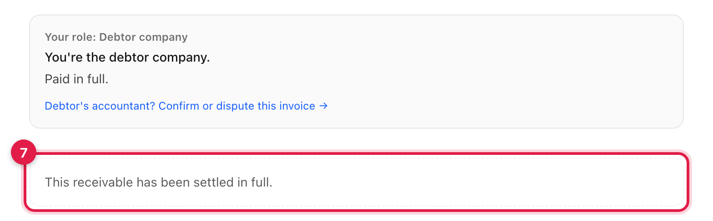

*ภาพที่ 27 — invoice ปิดแล้ว (รายละเอียดว่าชื่อ ENS ถูกถอนแล้วดูได้ในกล่อง Technical details ที่พับปิดอยู่)*

---

## บทที่ 6 กรณีพิเศษ

### 6.1 ปิดหน้าต่าง World ID กลางคัน (F1)

ถ้านักลงทุนปิดหน้าต่าง "Connect your World ID" (กดปุ่ม ×) ก่อนยืนยันเสร็จ จะไม่มีอะไรเสียหาย
กล่องซื้อจะแสดงข้อความสีแดง "Verification cancelled — only verified investors can buy receivables."

1. กดปุ่ม **Retry** เพื่อเปิดหน้าต่าง World ID ใหม่ แล้วทำตามบทที่ 2 ต่อจากข้อ 2

*ภาพที่ 28 — ยกเลิกการยืนยัน World ID แล้วกด Retry ได้*

### 6.2 ผู้ออกยกเลิก invoice

Supplier ยกเลิก invoice ได้เฉพาะตอนที่ยังไม่มีผู้ซื้อ (STATUS เป็น `For sale`) ตัวอย่างนี้ใช้ `inv-10.seikyu.eth` (ใบที่ถูกโต้แย้งไว้ในบทที่ 4)

1. เชื่อมต่อ wallet ของ supplier เปิดหน้า invoice แล้วกดปุ่ม **Cancel invoice** (ปุ่มขอบแดงในกล่องทำรายการ) และกด Confirm ใน MetaMask — ปุ่มเปลี่ยนเป็น `Cancelling…`

*ภาพที่ 29 — ปุ่ม Cancel invoice (มองเห็นเฉพาะผู้ออก invoice)*

2. เมื่อสำเร็จ ป้าย **STATUS** เปลี่ยนเป็น `Withdrawn by supplier` ชื่อ ENS ถูกถอนทันที

*ภาพที่ 30 — invoice ถูกยกเลิก*

กล่องบทบาทแสดง "Withdrawn by supplier." และกล่องทำรายการด้านล่างไม่มีปุ่มซื้อ มีเพียงข้อความ **"Withdrawn by the supplier."**

*ภาพที่ 31 — ไม่มีปุ่มซื้อหลังยกเลิก*

> **หมายเหตุ** ถ้ามีผู้ซื้อไปแล้ว การยกเลิกจะไม่ผ่าน (ข้อความ "Cancel failed — the invoice may already be sold.")

### 6.3 invoice ที่ถูกโต้แย้งซื้อไม่ได้

เมื่อฝ่ายบัญชีของลูกหนี้กด **Dispute** (บทที่ 4) นักลงทุนที่เปิดหน้า invoice นั้นจะเห็น

1. ป้าย **DEBTOR'S RESPONSE** เป็น `Disputed by debtor`

*ภาพที่ 32 — ป้าย Disputed by debtor บนหน้า invoice*

2. กล่องทำรายการไม่มีปุ่มใด ๆ มีเพียงข้อความสีแดง **"The debtor disputed this invoice, so it can't be bought."**

*ภาพที่ 33 — การซื้อถูกปิดจนกว่าจะได้รับการยืนยันใหม่*

การปิดนี้ไม่ได้อยู่แค่บนหน้าเว็บ สัญญา InvoiceMarket อ่านค่า `ack` จาก ENS ทุกครั้งที่มีการซื้อ และปฏิเสธด้วย `PurchaseBlockedByAck` ถ้าเป็น `disputed`

### 6.4 คนเดียวกันใช้ wallet ที่สอง (409)

World ID ให้รหัสประจำตัวแบบไม่ระบุตัวตน (nullifier) ที่ผูกกับ "คน" ไม่ใช่กับ wallet
เมื่อ wallet แรกยืนยันสำเร็จ รหัสนี้จะถูกบันทึกบน blockchain ว่าเป็นของ wallet นั้น
ถ้าคนเดิมเชื่อมต่อ wallet ที่สองแล้วทำบทที่ 2 ซ้ำด้วย identity เดิม เซิร์ฟเวอร์จะตอบกลับ `409 NULLIFIER_ALREADY_USED`
และกล่องซื้อจะแสดง "This World ID is already linked to 0x… One investor wallet per person." พร้อมปุ่ม **Retry**

ภาพนี้ถ่ายจาก wallet ของลูกหนี้ (`Debtor`, `0xb635…E72B`) เป็นตัวอย่าง "wallet ที่สองที่ยังไม่ยืนยัน" — ลองยืนยันด้วย Identity #1 ของ Simulator ซึ่งผูกกับนักลงทุน A (`0x6013…C131`) ไว้แล้ว

1. ข้อความสีแดงบอก address ของ wallet ที่ผูกกับ World ID นี้ไว้แล้ว
2. ปุ่ม **Retry** — กดซ้ำด้วย World ID เดิมจะได้ผลเหมือนเดิม

*ภาพที่ 34 — wallet ที่สองใช้ World ID เดียวกับนักลงทุน A (`0x6013…C131`) จึงถูกปฏิเสธ*

ให้กลับไปใช้ wallet เดิมที่ยืนยันไว้แล้ว หรือยืนยันด้วย identity อื่นที่ยังไม่เคยใช้ — ถ้าจำเป็นต้องปลดผูก identity เดิมจริง ๆ ต้องให้ผู้ดูแลระบบ (owner ของสัญญา) เรียก `revokeVerification` ก่อน

### 6.5 ครบกำหนดแล้วยังขายไม่ได้ (Expired-unsold)

ชื่อ ENS ของ invoice หมดอายุเองในวันครบกำหนด ถ้าถึงวันนั้นยังไม่มีผู้ซื้อ invoice จะอยู่ในสถานะ `Not sold in time`
ตัวอย่างคือ `inv-2.seikyu.eth` ซึ่งออกด้วยตัวเลือก **+10 minutes (quick demo)** ไว้ตั้งแต่การถ่ายภาพครั้งก่อน

1. ป้าย **STATUS** เป็น `Not sold in time`
2. รายการ **Due** แสดงเวลาที่ผ่านมาแล้ว (เช่น "… — 5 h past due")
3. ข้อมูลในกล่อง Technical details ยังอ่านได้ครบตามปกติ (เช่น `status` ยังเป็น `listed`) เพราะเก็บไว้ใน resolver ของ invoice ใบนั้น

*ภาพที่ 35 — inv-2.seikyu.eth หลังครบกำหนดโดยไม่มีผู้ซื้อ*

4. กล่องด้านล่างไม่มีปุ่มซื้อ มีข้อความ **"Not sold in time — nobody bought this invoice before its due date."**
   ในหน้า **Home** invoice แบบนี้จะอยู่ในหมวด **Needs attention**

*ภาพที่ 36 — ไม่มีการซื้อขายหลังหมดอายุ*

### 6.6 เลยกำหนดแต่ยังไม่จ่าย (Overdue และปุ่ม Mark overdue)

ถ้า invoice ถูกซื้อแล้ว (`Sold — awaiting payment`) แต่ลูกหนี้ยังไม่จ่ายเมื่อเลยวันครบกำหนด ชื่อ ENS จะหมดอายุตามปกติ และสถานะจะกลายเป็น `Past due — unpaid`
ตัวอย่างคือ `inv-8.seikyu.eth` (300 test USDC, ออกด้วยตัวเลือก **+10 minutes** แล้วให้นักลงทุน A ซื้อทันที เพื่อให้ครบกำหนดเร็วสำหรับสาธิต)

1. ป้าย **STATUS** เป็น `Past due — unpaid`
2. รายการ **Due** แสดง "… — just past due"

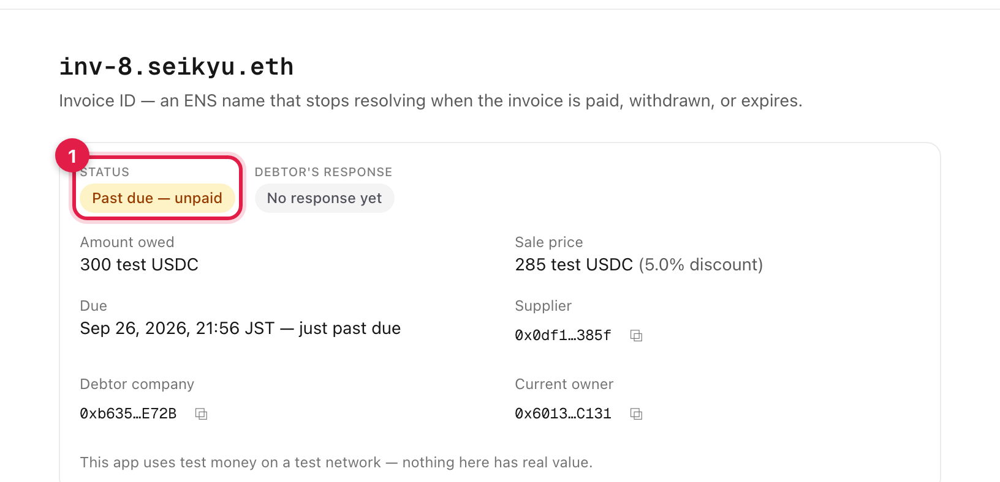

*ภาพที่ 37 — inv-8.seikyu.eth เลยกำหนดแล้ว ก่อนกด Mark overdue*

3. กล่องสีเหลืองขึ้นว่า "Past due — the debtor company can still pay. Mark overdue keeps the invoice's ENS name alive for 30 more days while payment is chased." พร้อมปุ่ม **Mark overdue**
   ด้านล่างยังมีกล่องชำระเงินตามบทที่ 5 — ลูกหนี้ยังจ่ายได้ตามปกติ
4. กดปุ่ม **Mark overdue** (ใครกดก็ได้ ไม่จำเป็นต้องเป็นผู้ถือ invoice) แล้วกด Confirm ใน MetaMask — ปุ่มเปลี่ยนเป็น `Marking…`

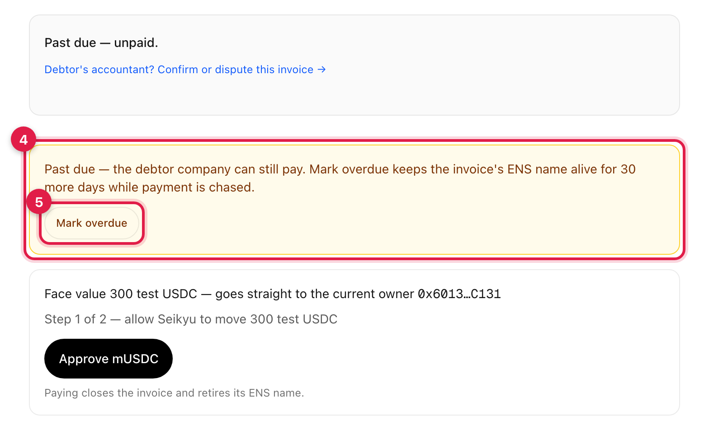

*ภาพที่ 38 — กล่อง Overdue พร้อมปุ่ม Mark overdue และกล่องชำระเงิน*

เมื่อธุรกรรม Mark overdue สำเร็จ (ระบบพากลับไปหน้า invoice ให้เอง) จะเห็น

5. ป้าย **STATUS** ยังเป็น `Past due — unpaid` เพราะยังไม่มีการจ่ายเงิน — รายการ **Due** ยังแสดงวันครบกำหนดเดิมเสมอ (ไม่ใช่วันหมดอายุใหม่ของ ENS)

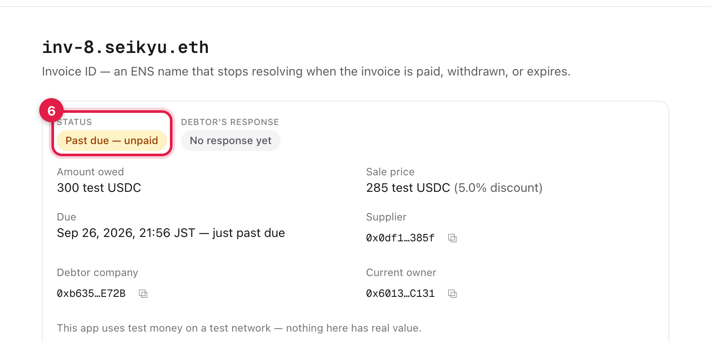

*ภาพที่ 39 — inv-8.seikyu.eth หลัง Mark overdue*

6. กล่องสีเหลืองเปลี่ยนเป็น **"Past due — the debtor company can still pay. This invoice stays active until Oct 26, 2026."**
   และไม่มีปุ่ม Mark overdue แล้ว (ต่ออายุได้ครั้งเดียวต่อการหมดอายุหนึ่งครั้ง) กล่องชำระเงินด้านล่างยังใช้ได้ตามบทที่ 5

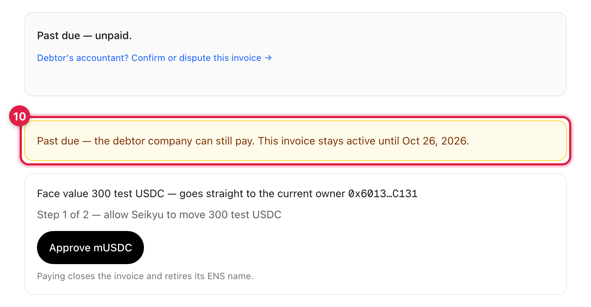

*ภาพที่ 40 — กล่อง Overdue หลังต่ออายุ และกล่องชำระเงินที่ยังใช้ได้*

> **อายุใหม่ของชื่อ** `markOverdue()` ต่ออายุชื่อ ENS ออกไปอีก **30 วันนับจากเวลาที่กด** (ค่าคงที่ `OVERDUE_EXTENSION` ในสัญญา InvoiceMarket) ไม่ใช่นับจากวันครบกำหนดเดิม
> รายละเอียดนี้ (ชื่อ ENS ยัง live หรือไม่ และ record `status`) ยังดูได้ในกล่อง Technical details ที่พับปิดอยู่เหมือนทุกหน้า — ปุ่ม STATUS/บรรทัด "Due" ที่เห็นด้านบนใช้ `market.dueDate` เดิมเสมอ ไม่ใช่วันหมดอายุ ENS ใหม่ ถ้าลูกหนี้ชำระ (บทที่ 5) หลังจากนั้น ระบบจะถอนชื่อ ENS ทันทีเหมือนกรณีปกติ

### 6.7 wallet อยู่คนละเครือข่าย (wrong network)

ถ้า wallet เชื่อมต่ออยู่แต่ไม่ได้อยู่บน Sepolia (เช่น สลับไปเครือข่ายอื่นโดยไม่ตั้งใจ) แอปจะแสดงแถบเตือนสีเหลืองใต้เมนูทันที และปุ่มทำธุรกรรมทุกปุ่มจะกดไม่ได้จนกว่าจะสลับกลับ

1. แถบ **"Your wallet is on the wrong network — Seikyu runs on the Sepolia test network."** พร้อมปุ่ม **Switch to Sepolia**

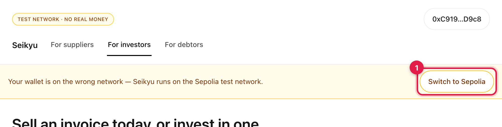

*ภาพที่ 41 — แถบเตือนเมื่อ wallet ไม่ได้อยู่บน Sepolia*

2. ปุ่มในกล่องทำรายการ (เช่น Approve mUSDC) จะเป็นสีเทาและกดไม่ได้ พร้อมข้อความ **"Switch to the Sepolia test network first (see the banner above)."**

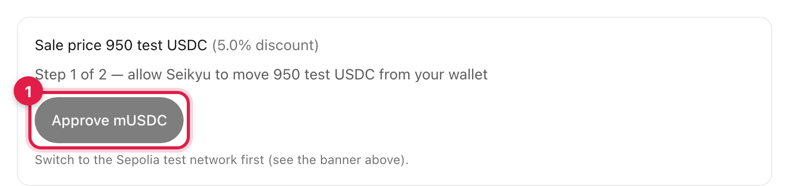

*ภาพที่ 42 — ปุ่ม Approve mUSDC ถูกปิดจนกว่าจะสลับเครือข่าย*

กดปุ่ม **Switch to Sepolia** เพื่อให้ MetaMask ขอสลับเครือข่ายให้ หรือสลับเองในตัว wallet

---

## ภาคผนวก ก ที่อยู่สัญญาและลิงก์ (Sepolia)

| รายการ | Address |
|---|---|
| InvoiceMarket | [`0x9Cf9989AfC0196720aa0A64F61a614CFB548B875`](https://eth-sepolia.blockscout.com/address/0x9Cf9989AfC0196720aa0A64F61a614CFB548B875) |
| InvoiceRegistrar | [`0x628701e9A322B019e4aFe31A077f393644D748eF`](https://eth-sepolia.blockscout.com/address/0x628701e9A322B019e4aFe31A077f393644D748eF) |
| test USDC (MockUSDC, ชื่อสัญญา mUSDC) | [`0x6B41ADF3e9A858136C28dfAC2432Eb2356E5451D`](https://eth-sepolia.blockscout.com/address/0x6B41ADF3e9A858136C28dfAC2432Eb2356E5451D) |
| UserRegistry (ENSv2 ของ `seikyu.eth`) | [`0xA9DFC9d1D5EA96b5Ade09d0E9B84944965B4eD67`](https://eth-sepolia.blockscout.com/address/0xA9DFC9d1D5EA96b5Ade09d0E9B84944965B4eD67) |
| ชื่อแม่ (parent name) | `seikyu.eth` |
| ENS app (Sepolia) | `https://sepolia.app.ens.domains/<ชื่อ invoice>` |
| World ID Simulator | https://simulator.worldcoin.org |

wallet ตัวอย่างที่ใช้ในคู่มือ

| บทบาท | Address |
|---|---|
| Supplier (ผู้ออก invoice) | `0x0df1770bB1b839E9aF883FcBD2C90ae27181385f` |
| Investor A | `0x601344DFBEd3Cc685CF49190f39c18B1b570C131` |
| Investor A2 (wallet ที่สองของคนเดิม) | `0xC91913F3eCDef9D30816C5D2d424142f3ABfD9c8` |
| Debtor (ลูกหนี้) | `0xb6359D76E104a9fF007c979d5b18b2804578E72B` |
| Debtor's accountant (ฝ่ายบัญชีของลูกหนี้) | `0xe1D7a414963005BdCeecA0da42a50A3FFF7d9aDe` |

> Investor A และ Investor A2 ยืนยัน World ID สำเร็จไปแล้วจากการถ่ายภาพครั้งก่อน (ดูหมายเหตุในบทที่ 2) รอบถ่ายภาพนี้จึงใช้ wallet ของ Debtor's accountant และ Debtor แทนสำหรับสองภาพที่ต้องมี wallet ที่ "ยังไม่ยืนยัน" — บทบาทหลักของ wallet เหล่านี้ (ฝ่ายบัญชี / ลูกหนี้) ไม่ได้รับผลกระทบ เพราะการยืนยัน World ID กับสิทธิ์แก้ `ack`/settle เป็นระบบคนละส่วนกัน

ธุรกรรมจริงที่เกิดขึ้นระหว่างถ่ายภาพคู่มือรอบนี้ (เปิดดูบน Blockscout)

| ขั้นตอน | ธุรกรรม |
|---|---|
| ออก invoice หลัก `inv-9.seikyu.eth` (CREATE) | [`0x06942d76…f0b838`](https://eth-sepolia.blockscout.com/tx/0x06942d76ffd9ae4ec7c2528e8de029cce49df691047d2f2008009fb995f0b838) |
| ฝ่ายบัญชียืนยัน `ack=acknowledged` (ACK) | [`0xd7451e65…f466f9d`](https://eth-sepolia.blockscout.com/tx/0xd7451e65b2136377a7cdd06ee7f12381abd4d4d06158b473fd6c8e456f466f9d) |
| ยืนยัน World ID ของฝ่ายบัญชี ด้วย Identity #2 (`InvestorVerified`, VERIFY) | [`0xa04b15ac…8ca1716`](https://eth-sepolia.blockscout.com/tx/0xa04b15ac2b3d7e1377f3391d6fc66b7ad540572591a170592c7b190bc8ca1716) |
| นักลงทุน A อนุญาต test USDC (สำหรับซื้อ) | [`0x7e6dafea…7cb02f4979`](https://eth-sepolia.blockscout.com/tx/0x7e6dafeacc1236797f1312a1c99ec02f5e556cf56534c4639586fc7cb02f4979) |
| นักลงทุน A ซื้อ `inv-9` (BUY) | [`0x03424dc3…7e18ea14b23`](https://eth-sepolia.blockscout.com/tx/0x03424dc38f1ed3e53a3394d8bae39d8465682d0484cee5e0a20ae7e18ea14b23) |
| ลูกหนี้อนุญาต test USDC (สำหรับชำระ) | [`0x02af7742…b72d1e45ad`](https://eth-sepolia.blockscout.com/tx/0x02af77427254975a62dcff742fe3be4f2874389b2e04b79e080b80b72d1e45ad) |
| ลูกหนี้ชำระ `inv-9` (SETTLE) — token burn และถอนชื่อ ENS | [`0x7e9978d0…9e94ec3ebeac`](https://eth-sepolia.blockscout.com/tx/0x7e9978d08accaf7dd2abee453cef710b2c330ce4edce717f361c9e94ec3ebeac) |
| ออก invoice ใบที่สอง `inv-10.seikyu.eth` | [`0x314c90ec…0d28d7e7e`](https://eth-sepolia.blockscout.com/tx/0x314c90ec13d7df0b8506106960af1e6de8dac8a9dc32b3f53eb27c90d28d7e7e) |
| ฝ่ายบัญชีโต้แย้ง `inv-10` (`ack=disputed`) | [`0x66c7f32c…b118b27b3`](https://eth-sepolia.blockscout.com/tx/0x66c7f32cc6ab65c9a0301e41858db14236cf9107657616f9cdbeb8bd118b27b3) |
| Supplier ยกเลิก `inv-10` | [`0x37c98801…60c231b44cee`](https://eth-sepolia.blockscout.com/tx/0x37c988010db6346b2ab9d64155c13215896ebda6e8d836db650660b231b44cee) |
| ออก invoice สาธิต Overdue `inv-8.seikyu.eth` | [`0x2a124e14…97581f304e0`](https://eth-sepolia.blockscout.com/tx/0x2a124e14d1a630c33d457ee7baae3ff81f4d48ddd62a71c115a8c97581f304e0) |
| นักลงทุน A ซื้อ `inv-8` ทันทีเพื่อให้ครบกำหนดตอน Funded | [`0x56d4c18c…3ffa500b9b98a`](https://eth-sepolia.blockscout.com/tx/0x56d4c18c2a588c1170a0a74fd7923096b90f1e0a9fb415b33903ffa500b9b98a) |
| Mark overdue ให้ `inv-8` (ต่ออายุชื่อ 30 วัน) | [`0x78af4c6c…98012b55e`](https://eth-sepolia.blockscout.com/tx/0x78af4c6c066c24ea0c33bc8e3ac0dd84e77efb47f435a269abc0f0e98012b55e) |

> **หมายเหตุ** ลิงก์ **View transaction →** และลิงก์ address ในแอปเปิดไปที่ Etherscan ส่วนตารางนี้ใช้ Blockscout
> ซึ่งแสดง source code ของสัญญาครบทั้งสามตัว บทที่ 6.1 (F1), 6.4 (409) และ 6.7 (wrong network) ไม่มีธุรกรรมเกิดขึ้นจริงตามธรรมชาติของกรณีที่สาธิต

## ภาคผนวก ข คำถามที่พบบ่อย

**ทำไมยืนยัน World ID ไม่ผ่าน**

ดูข้อความสีแดงในกล่องซื้อ แล้วเทียบกับรายการนี้

- "This World ID is already linked to 0x… One investor wallet per person." (`409 NULLIFIER_ALREADY_USED`) — World ID นี้ผูกกับ wallet อื่นแล้ว
  ใช้ wallet เดิม หรือบน staging ให้สลับไปใช้ identity อื่นของ Simulator ที่ยังไม่เคยใช้ (ขั้นตอนด้านล่าง) และเลือก **Legacy v3 proof** ตามบทที่ 2
- "This credential doesn't match what this action requires. …" (`422 CREDENTIAL_MISMATCH`) — credential ที่ส่งมาไม่ตรงกับที่ระบบตั้งไว้
  ตรวจว่าเลือก **Human** ใน Simulator (หรือ credential ที่ World App ขอ)
- "Verification cancelled — …" — ปิดหน้าต่าง World ID ก่อนเสร็จ กด **Retry** (บทที่ 6.1)
- "Verification failed. Please try again." — ปัญหาฝั่งเซิร์ฟเวอร์หรือ World เช่น staging window ปิดอยู่ (ดูหัวข้อถัดไป) ลองใหม่ภายหลังหรือแจ้งผู้ดูแลระบบ
- ไม่เห็นลิงก์ **Use the simulator** — หน้าต่างเบราว์เซอร์แคบเกินไป (บทที่ 2 ข้อ 2) หรือระบบตั้งเป็น production ซึ่งต้องใช้ World App

**สลับ identity ใน World ID Simulator (staging)** — Simulator มี identity ทดสอบให้เลือก 5 ชุด (Identity #0 ถึง #4) ที่ทุกคนใช้ร่วมกัน
และกดปุ่ม **+** เพื่อสร้างเพิ่มได้

1. ในหน้าแรกของ Simulator กดรูปโปรไฟล์ (ปุ่ม Settings) มุมขวาบนของหน้าจอโทรศัพท์จำลอง
2. กด **Switch test identity**

*ภาพที่ 43 — หน้า Settings ของ World ID Simulator (identity ที่ใช้อยู่ตอนนั้นคือ #4)*

3. กดเลือก identity ที่ต้องการ (ในภาพคือ Identity #2 ซึ่งยังไม่เคยใช้ ณ ตอนถ่ายภาพ) — Simulator จะกลับไปหน้าแรกพร้อม identity ใหม่ จากนั้นเริ่มบทที่ 2 ใหม่ตั้งแต่ข้อ 1

*ภาพที่ 44 — เลือก identity ทดสอบ*

**Staging window คืออะไร**
ช่วงทดสอบ (staging) World ID จะรับหลักฐานจาก Simulator ก็ต่อเมื่อเจ้าของแอปเปิด "staging verification window" ไว้ใน World Developer Portal
และเซิร์ฟเวอร์ของแอปมีค่า `WORLD_STAGING_VERIFICATION_TOKEN` ถ้าไม่มี เซิร์ฟเวอร์จะตอบ `503 STAGING_TOKEN_MISSING` และการยืนยันจะขึ้นว่า "Verification failed. Please try again."
ติดต่อผู้ดูแลระบบให้เปิด window ใหม่ ระบบจริง (production) ไม่ต้องใช้ขั้นตอนนี้

**ทำไมห้ามใช้ smart account (EIP-7702) เป็นผู้ออก invoice**
ตอนออก invoice ระบบ ENS จะโอนชื่อ invoice ให้ผู้ออกในรูป token มาตรฐาน ERC-1155 ซึ่งจะล้มเหลว (`ERC1155InvalidReceiver`) ถ้า wallet นั้นมี code อยู่
MetaMask ที่เปิดโหมด smart account (EIP-7702) จะมี code ติดอยู่ หน้า **List an invoice for sale** จึงแสดงกล่องเตือนสีเหลือง
"Smart-account wallets can't list invoices — please use a regular wallet address." และปิดปุ่ม **Issue invoice** — ให้ใช้บัญชี MetaMask ธรรมดาที่ไม่ได้อัปเกรด
(บทบาทอื่น เช่น นักลงทุนหรือลูกหนี้ ไม่มีข้อจำกัดนี้)

**ตัวเลขใน ENS records ไม่ตรงกับยอดเงิน**
`amount` เก็บเป็นจำนวนเต็มที่มีทศนิยม 6 ตำแหน่งแบบ USDC — `1000000000` คือ 1,000.00 test USDC ส่วน `dueDate` เป็นเวลาแบบ Unix (วินาที)

**ป้าย Debtor's response เป็น "Confirmed by debtor" แปลว่าลูกหนี้จะจ่ายแน่นอนไหม**
ไม่ใช่ ป้ายนี้เป็นเพียงการยืนยันจากฝ่ายบัญชีที่ supplier ระบุเอง ตลาดนี้เป็นแบบไม่มีสิทธิ์ไล่เบี้ย (non-recourse) — ถ้าลูกหนี้ไม่จ่าย ผู้ถือ invoice รับความเสี่ยงเอง

**ทำไมปุ่มในกล่องทำรายการเป็นสีเทากดไม่ได้ทั้งที่เชื่อมต่อ wallet แล้ว**
ตรวจแถบเตือนใต้เมนู — ถ้าขึ้นว่า "Your wallet is on the wrong network" ให้กด **Switch to Sepolia** ก่อน (บทที่ 6.7) ปุ่มจะกลับมาใช้งานได้ปกติทันทีที่ wallet อยู่บน Sepolia
